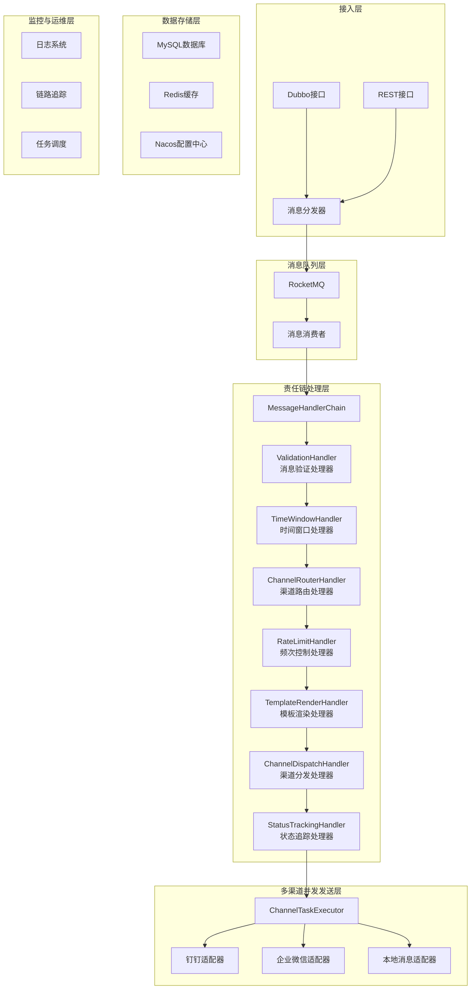

# 消息中心系统

## 1. 项目简介

消息中心系统是一个通用的消息发送平台，提供统一的消息发送能力，支持多种消息类型和渠道，实现消息的高效、可靠发送。

### 1.1 核心功能

- **多渠道支持**：支持本地消息、钉钉、企业微信等多种渠道
- **统一接口**：提供统一的Dubbo和REST接口，简化消息发送流程
- **灵活配置**：支持门店级和租户级两级配置，满足不同业务场景需求
- **模板化管理**：支持多种消息模板，实现消息内容的动态生成
- **可靠发送**：支持消息重试、状态追踪、故障隔离等机制，确保消息可靠送达
- **高性能**：采用消息队列、并发发送等机制，支持高并发消息处理
- **智能路由**：根据租户/门店配置自动匹配发送渠道
- **频次控制**：支持按渠道配置发送频次限制
- **时间窗口**：支持配置消息发送的时间窗口

## 2. 技术栈

| 技术类别 | 技术栈 | 版本 | 用途 |
|----------|--------|------|------|
| 应用框架 | Spring Boot | 3.3.5 | 应用开发框架 |
| ORM框架 | MyBatis-Plus | 3.5.6 | 数据库访问 |
| 消息队列 | RocketMQ | 2.3.0 | 消息解耦和异步处理 |
| 分布式锁 | Redisson | 3.27.2 | 分布式锁和缓存 |
| 数据库 | MySQL | 8.0 | 数据存储 |
| 缓存 | Redis | 6.0 | 缓存和频次控制 |
| RPC框架 | Dubbo | 3.3.0 | 远程服务调用 |
| 简化代码 | Lombok | 1.18.30 | 简化Java代码 |
| 工具类库 | Hutool | 5.7.22 | Java工具类 |
| 工具类库 | Guava | 31.1-jre | 谷歌工具类 |
| JSON处理 | Fastjson2 | 2.0.57 | JSON处理 |
| 任务调度 | XXL-Job | 3.0.0 | 分布式任务调度 |
| 配置中心 | Nacos | 2.2.0 | 配置管理和服务注册 |
| API文档 | SpringDoc OpenAPI | 2.2.0 | 生成API文档 |
| 日志处理 | Logback | 1.2.3 | 日志管理 |
| 链路追踪 | SkyWalking | 9.0.0 | 链路追踪 |
| 分页插件 | PageHelper | 2.1.0 | 分页查询 |

## 3. 系统架构

### 3.1 DDD分层架构

项目采用标准的DDD（领域驱动设计）四层架构：

#### 接口层 (interfaces)
- **rest**: REST API控制器，提供HTTP接口
- **dubbo**: Dubbo RPC服务接口和实现，提供远程调用能力

#### 应用层 (application)
- **handler**: 责任链处理器（验证、路由、限流、模板渲染等）
- **service**: 应用服务，协调领域服务完成业务用例
- **strategy**: 执行策略（并发执行等）
- **command**: 命令对象（预留CQRS模式）
- **query**: 查询对象（预留CQRS模式）

#### 领域层 (domain)
- **entity**: 领域实体（Message、ChannelTask、ChannelConfig、MessageTemplate）
- **vo**: 值对象（MessageContext、SendResult、HandlerResult等）
- **enums**: 枚举类型（ChannelType、MessageStatus等）
- **service**: 领域服务（MessageDomainService、ChannelTaskDomainService）
- **repository**: 仓储接口定义
- **event**: 领域事件（预留事件驱动架构）

#### 基础设施层 (infrastructure)
- **adapter**: 外部系统适配器（钉钉、企业微信等渠道适配器）
- **config**: 配置类（数据库、线程池、Swagger等）
- **executor**: 任务执行器（渠道任务并发执行）
- **data**: 数据访问层
  - **mapper**: MyBatis Mapper接口
  - **repository**: 仓储接口实现

### 3.2 整体架构



### 3.3 核心设计模式

- **责任链模式**：消息处理全流程采用责任链模式，便于扩展和维护
- **适配器模式**：不同渠道的发送逻辑通过适配器模式统一接口
- **策略模式**：同一渠道的不同消息类型采用策略模式处理
- **异步处理模式**：消息通过RocketMQ异步处理，提高系统吞吐量
- **并发模式**：多渠道消息并发发送，提高发送效率

## 4. 快速开始

### 4.1 环境准备

- JDK 17+
- MySQL 8.0+
- Redis 6.0+
- RocketMQ 4.9.0+
- Nacos 2.2.0+

### 4.2 数据库初始化

1. 创建数据库
```sql
CREATE DATABASE IF NOT EXISTS message_center 
DEFAULT CHARACTER SET utf8mb4 
DEFAULT COLLATE utf8mb4_bin;
```

2. 执行初始化脚本
```bash
mysql -u root -p message_center < src/main/resources/init.sql
```

### 4.3 配置文件修改

修改 `src/main/resources/application-dev.yml` 文件，配置数据库、Redis、RocketMQ、Nacos等服务地址和认证信息。

### 4.4 启动服务

```bash
# 使用Maven启动
mvn spring-boot:run -Dspring.profiles.active=dev

# 使用Java命令启动
java -jar target/message-center-1.0.0.jar --spring.profiles.active=dev
```

### 4.5 访问API文档

启动成功后，访问以下地址查看API文档：
- Swagger UI：http://localhost:8080/swagger-ui/index.html
- OpenAPI JSON：http://localhost:8080/v3/api-docs

## 5. API使用指南

### 5.1 Dubbo API

#### 5.1.1 消息发送接口

```java
// 导入依赖
<dependency>
    <groupId>com.message.center</groupId>
    <artifactId>message-center</artifactId>
    <version>1.0.0</version>
</dependency>

// 使用示例
@Reference
private MessageSendService messageSendService;

public void sendMessage() {
    Message message = new Message();
    message.setTenantId(1001L);
    message.setBusinessType("ORDER_NOTIFY");
    message.setBusinessData("{\"orderId\":\"ORD123456\",\"customerName\":\"张三\",\"amount\":199.0}");
    
    SendResult result = messageSendService.sendMessage(message);
    if (result.isSuccess()) {
        System.out.println("消息发送成功，消息ID：" + result.getMessageId());
    } else {
        System.out.println("消息发送失败：" + result.getErrorMessage());
    }
}
```

### 5.2 REST API

#### 5.2.1 发送单条消息

```bash
# 使用curl发送
curl -X POST http://localhost:8080/api/messages \
  -H "Content-Type: application/json" \
  -d '{
    "tenantId": 1001,
    "businessType": "ORDER_NOTIFY",
    "businessData": {"orderId": "ORD123456", "customerName": "张三", "amount": 199.0}
  }'
```

#### 5.2.2 批量发送消息

```bash
# 使用curl发送
curl -X POST http://localhost:8080/api/messages/batch \
  -H "Content-Type: application/json" \
  -d '[
    {
      "tenantId": 1001,
      "businessType": "ORDER_NOTIFY",
      "businessData": {"orderId": "ORD123456", "customerName": "张三", "amount": 199.0}
    },
    {
      "tenantId": 1001,
      "businessType": "NOTIFY",
      "businessData": {"content": "测试通知"}
    }
  ]'
```

## 6. 核心模块说明

### 6.1 消息处理流程

1. **消息接入**：通过Dubbo或REST接口接收消息
2. **消息分发**：将消息分发到RocketMQ
3. **责任链处理**：
   - 消息验证
   - 时间窗口检查
   - 渠道路由
   - 频次控制
   - 模板渲染
   - 渠道分发
   - 状态追踪
4. **渠道发送**：并发执行各渠道发送任务
5. **状态更新**：更新消息和任务状态

### 6.2 渠道配置管理

- **两级配置**：支持租户级和门店级配置
- **灵活配置**：支持配置渠道类型、认证信息、webhook地址、优先级、启用状态等
- **频次控制**：支持按租户+渠道维度配置发送频次
- **时间窗口**：支持配置消息发送的时间窗口

### 6.3 消息模板管理

- **三维配置**：按业务类型+渠道类型+消息类型配置
- **动态渲染**：使用占位符语法定义动态字段，根据业务数据渲染
- **多消息类型**：支持文本、markdown、卡片、链接等多种消息类型

### 6.4 消息重试机制

- **自动重试**：失败的消息自动重试
- **指数退避**：重试间隔按指数递增
- **最大重试次数**：可配置最大重试次数
- **状态追踪**：每次重试状态都有记录

## 7. 监控与运维

### 7.1 监控指标

- **消息发送量**：每秒发送的消息数量
- **成功率**：消息发送成功率
- **响应时间**：消息处理响应时间
- **渠道发送状态**：各渠道的发送成功率和失败率
- **资源使用率**：CPU、内存、磁盘、网络使用率

### 7.2 日志管理

- **日志级别**：支持DEBUG、INFO、WARN、ERROR四级日志
- **日志格式**：包含时间、线程、级别、类名、日志内容等
- **日志存储**：本地文件存储，定期归档

### 7.3 链路追踪

- **全链路追踪**：使用SkyWalking实现全链路追踪
- **链路查询**：根据消息ID查询完整的处理链路
- **性能分析**：分析各环节的处理时间

## 8. 扩展指南

### 8.1 新增渠道

1. 实现`ChannelType`枚举，添加新的渠道类型
2. 实现`ChannelAdapter`接口，编写新渠道的发送逻辑
3. 在`ChannelConfig`中配置新渠道的配置项
4. 在前端界面中添加新渠道的配置支持

### 8.2 新增处理器

1. 实现`MessageHandler`接口，编写新处理器的逻辑
2. 使用`@Component`注解将处理器注册到Spring容器
3. 通过`getOrder()`方法设置处理器的执行顺序
4. 处理器将自动加入责任链，按顺序执行

### 8.3 新增消息类型

1. 实现`MessageType`枚举，添加新的消息类型
2. 在`MessageTemplate`中配置新消息类型的模板
3. 在渠道适配器中添加对新消息类型的支持

## 9. 部署方案

### 9.1 单机部署

适用于开发和测试环境：

```bash
java -jar message-center-1.0.0.jar --spring.profiles.active=dev
```

### 9.2 集群部署

适用于生产环境：

1. 部署多个消息中心实例
2. 使用Nacos进行服务注册和配置管理
3. 使用RocketMQ集群确保消息可靠传递
4. 使用Redis集群确保缓存和分布式锁的可靠性
5. 使用负载均衡器分发请求

### 9.3 Docker部署

```bash
# 构建Docker镜像
docker build -t message-center:1.0.0 .

# 运行Docker容器
docker run -d --name message-center \
  -p 8080:8080 \
  -e SPRING_PROFILES_ACTIVE=prod \
  -e NACOS_SERVER=127.0.0.1:8848 \
  -e MYSQL_HOST=127.0.0.1 \
  -e MYSQL_PORT=3306 \
  -e MYSQL_DATABASE=message_center \
  -e MYSQL_USERNAME=root \
  -e MYSQL_PASSWORD=password \
  -e REDIS_HOST=127.0.0.1 \
  -e REDIS_PORT=6379 \
  -e ROCKETMQ_NAMESRV=127.0.0.1:9876 \
  message-center:1.0.0
```

## 10. 常见问题

### 10.1 消息发送失败

- **检查渠道配置**：查看渠道配置是否正确，是否启用
- **检查模板配置**：查看是否配置了对应的消息模板
- **检查频次限制**：查看是否触发了频次限制
- **检查时间窗口**：查看是否在允许发送的时间窗口内
- **查看日志**：查看系统日志，找出具体的错误原因

### 10.2 消息重复发送

- **检查消息ID**：确保每条消息都有唯一的消息ID
- **检查消息去重机制**：确保系统开启了消息去重功能
- **检查消息状态**：查看消息状态是否正确

### 10.3 性能问题

- **检查线程池配置**：调整线程池参数，优化并发性能
- **检查缓存配置**：合理设置缓存大小和过期时间
- **检查数据库性能**：优化数据库查询，添加索引
- **检查网络连接**：确保网络连接稳定

## 11. 版本历史

| 版本 | 发布时间 | 主要功能 |
|------|----------|----------|
| 1.0.0 | 2023-12-06 | 初始版本，支持本地消息、钉钉、企业微信发送 |

## 12. 贡献指南

欢迎大家贡献代码和提出建议！

1. Fork本仓库
2. 创建特性分支
3. 提交代码
4. 推送分支
5. 创建Pull Request

## 13. 许可证

本项目采用Apache 2.0许可证。

## 14. 联系方式

- 项目地址：https://github.com/example/message-center
- 邮箱：message-center@example.com
- 微信群：扫码加入消息中心交流群
- 钉钉群：扫码加入消息中心交流群