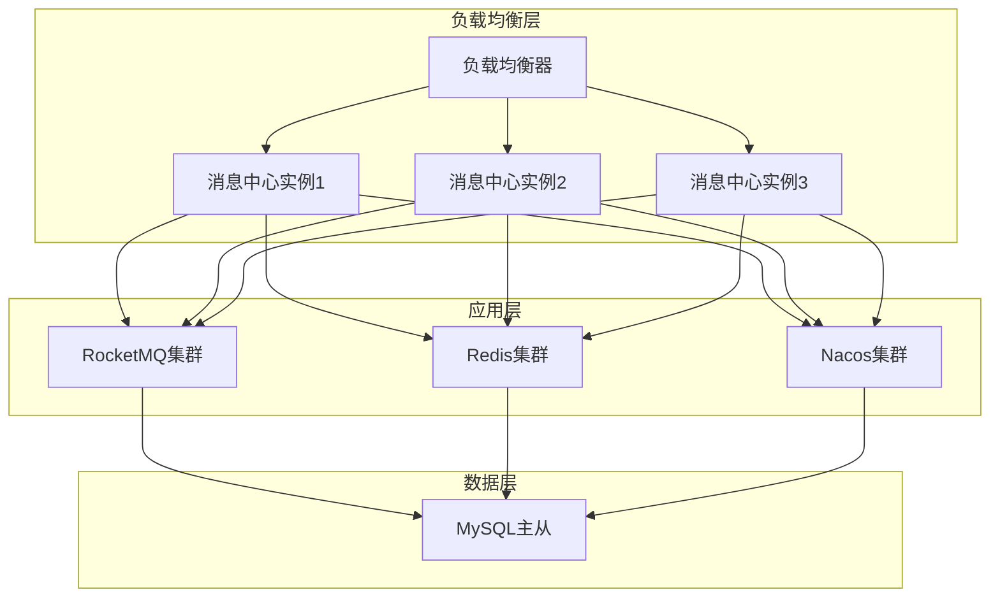

# 消息中心系统部署指南

## 1. 部署准备

### 1.1 环境要求

| 环境 | 版本要求 | 说明 |
|------|----------|------|
| JDK | 17+ | 必须使用Java 17或以上版本 |
| MySQL | 8.0+ | 支持分区表功能 |
| Redis | 6.0+ | 用于缓存和分布式锁 |
| RocketMQ | 4.9.0+ | 用于消息队列 |
| Nacos | 2.2.0+ | 用于服务注册和配置中心 |
| XXL-Job | 3.0.0+ | 用于分布式任务调度 |
| SkyWalking | 9.0.0+ | 用于链路追踪 |

### 1.2 依赖组件安装

#### 1.2.1 MySQL安装

- 下载地址：https://dev.mysql.com/downloads/mysql/
- 安装教程：https://dev.mysql.com/doc/refman/8.0/en/installing.html
- 配置要求：
  - 开启分区表支持（默认开启）
  - 设置合适的innodb_buffer_pool_size
  - 开启binlog（可选，用于数据恢复）

#### 1.2.2 Redis安装

- 下载地址：https://redis.io/download/
- 安装教程：https://redis.io/docs/getting-started/installation/
- 配置要求：
  - 设置合适的maxmemory
  - 开启持久化（rdb或aof）
  - 设置密码（可选，建议开启）

#### 1.2.3 RocketMQ安装

- 下载地址：https://rocketmq.apache.org/download/
- 安装教程：https://rocketmq.apache.org/docs/quick-start/
- 配置要求：
  - 设置合适的堆内存大小
  - 开启自动创建主题（autoCreateTopicEnable=true）

#### 1.2.4 Nacos安装

- 下载地址：https://github.com/alibaba/nacos/releases
- 安装教程：https://nacos.io/zh-cn/docs/quick-start.html
- 配置要求：
  - 选择合适的持久化方式（derby或mysql）
  - 配置集群模式（生产环境建议集群部署）

#### 1.2.5 XXL-Job安装

- 下载地址：https://github.com/xuxueli/xxl-job/releases
- 安装教程：https://www.xuxueli.com/xxl-job/
- 配置要求：
  - 初始化数据库脚本
  - 配置调度中心地址

#### 1.2.6 SkyWalking安装

- 下载地址：https://skywalking.apache.org/downloads/
- 安装教程：https://skywalking.apache.org/docs/main/v9.0.0/en/setup/backend/backend-setup/
- 配置要求：
  - 选择合适的存储方式（elasticsearch或mysql）
  - 配置OAP服务器地址

## 2. 数据库初始化

### 2.1 创建数据库

```sql
CREATE DATABASE IF NOT EXISTS message_center 
DEFAULT CHARACTER SET utf8mb4 
DEFAULT COLLATE utf8mb4_bin;
```

### 2.2 创建数据库表

执行`database-design.md`中的SQL脚本，创建所有数据库表：

- `msg_channel_config`：渠道配置表
- `msg_template`：消息模板表
- `msg_message`：消息主表（分区表）
- `msg_channel_task`：渠道任务表（分区表）

### 2.3 初始化基础数据

#### 2.3.1 初始化渠道配置

```sql
INSERT INTO `msg_channel_config` (`tenant_id`, `store_id`, `channel_type`, `channel_name`, `config_json`, `priority`, `enabled`, `rate_limit_count`, `rate_limit_window`, `rate_limit_unit`, `time_window_enabled`, `time_window_start_hour`, `time_window_end_hour`) VALUES
(1001, NULL, 'LOCAL', '本地消息', '{}', 1, 1, 100, 60, 'SECOND', 0, 0, 23),
(1001, NULL, 'DINGTALK', '钉钉机器人', '{"webhook": "https://oapi.dingtalk.com/robot/send?access_token=xxx", "secret": "xxx"}', 1, 1, 100, 60, 'SECOND', 0, 0, 23),
(1001, NULL, 'WECHAT_WORK', '企业微信群机器人', '{"webhook": "https://qyapi.weixin.qq.com/cgi-bin/webhook/send?key=xxx"}', 1, 1, 100, 60, 'SECOND', 0, 0, 23);
```

#### 2.3.2 初始化消息模板

```sql
INSERT INTO `msg_template` (`tenant_id`, `business_type`, `channel_type`, `message_type`, `template_name`, `template_content`, `enabled`) VALUES
(1001, 'ORDER_NOTIFY', 'LOCAL', 'TEXT', '订单通知模板', '您有一笔新订单：${orderId}，金额：${amount}元', 1),
(1001, 'ORDER_NOTIFY', 'DINGTALK', 'TEXT', '订单通知模板', '您有一笔新订单：${orderId}，金额：${amount}元', 1),
(1001, 'ORDER_NOTIFY', 'WECHAT_WORK', 'TEXT', '订单通知模板', '您有一笔新订单：${orderId}，金额：${amount}元', 1);
```

## 3. 应用部署

### 3.1 部署方式

#### 3.1.1 传统部署

1. **下载安装包**
   - 从代码仓库拉取最新代码
   - 执行`mvn clean package -DskipTests`编译打包
   - 生成的jar包位于`target`目录下

2. **配置文件修改**
   - 复制`application.yml`到jar包所在目录
   - 根据实际环境修改配置文件中的数据库、Redis、RocketMQ、Nacos等配置

3. **启动应用**
   ```bash
   java -jar message-center-1.0.0.jar --spring.profiles.active=prod
   ```

#### 3.1.2 Docker部署

1. **构建Docker镜像**
   ```bash
   docker build -t message-center:1.0.0 .
   ```

2. **运行Docker容器**
   ```bash
   docker run -d --name message-center \
     -p 8080:8080 \
     -e SPRING_PROFILES_ACTIVE=prod \
     -e NACOS_SERVER=127.0.0.1:8848 \
     -e MYSQL_HOST=127.0.0.1 \
     -e MYSQL_PORT=3306 \
     -e MYSQL_DATABASE=message_center \
     -e MYSQL_USERNAME=root \
     -e MYSQL_PASSWORD=password \
     -e REDIS_HOST=127.0.0.1 \
     -e REDIS_PORT=6379 \
     -e ROCKETMQ_NAMESRV=127.0.0.1:9876 \
     message-center:1.0.0
   ```

#### 3.1.3 Kubernetes部署

1. **创建Deployment**
   ```yaml
   apiVersion: apps/v1
   kind: Deployment
   metadata:
     name: message-center
     namespace: message-center
   spec:
     replicas: 3
     selector:
       matchLabels:
         app: message-center
     template:
       metadata:
         labels:
           app: message-center
       spec:
         containers:
         - name: message-center
           image: message-center:1.0.0
           ports:
           - containerPort: 8080
           env:
           - name: SPRING_PROFILES_ACTIVE
             value: "prod"
           - name: NACOS_SERVER
             value: "nacos:8848"
           - name: MYSQL_HOST
             value: "mysql"
           - name: MYSQL_PORT
             value: "3306"
           - name: MYSQL_DATABASE
             value: "message_center"
           - name: MYSQL_USERNAME
             value: "root"
           - name: MYSQL_PASSWORD
             valueFrom:
               secretKeyRef:
                 name: mysql-secret
                 key: password
           - name: REDIS_HOST
             value: "redis"
           - name: REDIS_PORT
             value: "6379"
           - name: ROCKETMQ_NAMESRV
             value: "rocketmq-namesrv:9876"
   ```

2. **创建Service**
   ```yaml
   apiVersion: v1
   kind: Service
   metadata:
     name: message-center
     namespace: message-center
   spec:
     selector:
       app: message-center
     ports:
     - port: 80
       targetPort: 8080
     type: LoadBalancer
   ```

3. **部署应用**
   ```bash
   kubectl apply -f message-center-deployment.yaml
   kubectl apply -f message-center-service.yaml
   ```

### 3.2 集群部署

#### 3.2.1 部署架构



#### 3.2.2 部署建议

- 消息中心应用至少部署3个实例，确保高可用性
- RocketMQ、Redis、Nacos等中间件采用集群部署
- MySQL采用主从架构，实现读写分离
- 负载均衡器采用nginx或F5，实现请求的均匀分发

## 4. 配置管理

### 4.1 系统配置

#### 4.1.1 Nacos配置

- 登录Nacos控制台：http://localhost:8848/nacos
- 创建配置集：
  - Data ID: message-center.yaml
  - Group: DEFAULT_GROUP
  - 配置格式: YAML
  - 配置内容:

```yaml
message-center:
  retry:
    max-count: 3
    interval-seconds: 60
    backoff-multiplier: 2
  thread-pool:
    core-size: 10
    max-size: 50
    queue-capacity: 1000
    keep-alive-seconds: 60
  timeout:
    single-channel-seconds: 30
    all-channels-seconds: 120
  channel:
    execution-mode: CONCURRENT
    thread-pool:
      core-size: 10
      max-size: 50
      queue-capacity: 1000
      keep-alive-seconds: 60
    timeout:
      single-channel-seconds: 30
      all-channels-seconds: 120
    priority:
      continue-on-fail: true
      skip-on-success: false
```

#### 4.1.2 本地配置

- 应用启动时会从本地`application.yml`读取配置
- 本地配置会被Nacos配置覆盖
- 建议只在本地配置文件中配置环境相关的基础配置，业务配置统一放在Nacos中

### 4.2 配置优先级

1. 命令行参数
2. 系统环境变量
3. Nacos配置中心
4. 本地application-{profile}.yml
5. 本地application.yml
6. Spring Boot默认配置

## 5. 监控与运维

### 5.1 监控指标

#### 5.1.1 应用指标

- **CPU使用率**：监控应用的CPU使用情况
- **内存使用率**：监控应用的内存使用情况
- **GC情况**：监控垃圾回收情况，包括GC次数、GC时间等
- **线程数**：监控应用的线程数量，包括活跃线程数、峰值线程数等
- **响应时间**：监控API的响应时间
- **吞吐量**：监控每秒处理的请求数量

#### 5.1.2 业务指标

- **消息发送量**：监控每秒发送的消息数量
- **消息成功率**：监控消息发送的成功率
- **消息失败率**：监控消息发送的失败率
- **渠道发送量**：按渠道监控消息发送量
- **渠道成功率**：按渠道监控消息发送成功率
- **重试次数**：监控消息重试的次数

### 5.2 监控工具

#### 5.2.1 Prometheus + Grafana

1. **安装Prometheus**
   - 下载地址：https://prometheus.io/download/
   - 配置文件：
   ```yaml
   global:
     scrape_interval: 15s
     evaluation_interval: 15s

   scrape_configs:
     - job_name: 'message-center'
       metrics_path: '/actuator/prometheus'
       static_configs:
         - targets: ['localhost:8080']
   ```

2. **安装Grafana**
   - 下载地址：https://grafana.com/grafana/download
   - 配置Prometheus数据源
   - 导入Spring Boot监控仪表盘（ID：12856）

#### 5.2.2 SkyWalking

1. **安装SkyWalking OAP Server**
   - 下载地址：https://skywalking.apache.org/downloads/
   - 启动命令：
   ```bash
   bin/oapService.sh
   ```

2. **安装SkyWalking UI**
   - 下载地址：https://skywalking.apache.org/downloads/
   - 启动命令：
   ```bash
   bin/webappService.sh
   ```

3. **配置应用Agent**
   ```bash
   java -javaagent:/path/to/skywalking-agent/skywalking-agent.jar \
        -Dskywalking.agent.service_name=message-center \
        -Dskywalking.collector.backend_service=localhost:11800 \
        -jar message-center-1.0.0.jar
   ```

### 5.3 日志管理

#### 5.3.1 日志配置

- **日志级别**：可通过application.yml配置不同包的日志级别
- **日志格式**：包含时间、线程、级别、类名、日志内容、traceId等信息
- **日志输出**：
  - 控制台输出：用于开发和调试
  - 文件输出：用于生产环境
  - ELK输出：用于日志集中管理和分析

#### 5.3.2 ELK集成

1. **安装Elasticsearch**
   - 下载地址：https://www.elastic.co/downloads/elasticsearch
   - 启动命令：
   ```bash
   bin/elasticsearch
   ```

2. **安装Logstash**
   - 下载地址：https://www.elastic.co/downloads/logstash
   - 配置文件：
   ```conf
   input {
     file {
       path => "/path/to/message-center/logs/*.log"
       type => "message-center"
       start_position => "beginning"
     }
   }

   filter {
     grok {
       match => {
         "message" => "%{TIMESTAMP_ISO8601:timestamp} %{LOGLEVEL:level} \[%{DATA:thread}\] %{DATA:class} - %{GREEDYDATA:content}"
       }
     }
     date {
       match => ["timestamp", "yyyy-MM-dd HH:mm:ss.SSS"]
       target => "@timestamp"
     }
   }

   output {
     elasticsearch {
       hosts => ["localhost:9200"]
       index => "message-center-%{+YYYY.MM.dd}"
     }
   }
   ```
   - 启动命令：
   ```bash
   bin/logstash -f logstash-message-center.conf
   ```

3. **安装Kibana**
   - 下载地址：https://www.elastic.co/downloads/kibana
   - 启动命令：
   ```bash
   bin/kibana
   ```

4. **创建索引模式**
   - 登录Kibana控制台：http://localhost:5601
   - 创建索引模式：message-center-*
   - 查看日志：在Discover页面查看日志

### 5.4 告警管理

#### 5.4.1 告警规则

| 告警类型 | 告警条件 | 告警级别 | 处理方式 |
|----------|----------|----------|----------|
| CPU使用率过高 | CPU使用率 > 80% 持续5分钟 | 警告 | 检查应用负载，考虑扩容 |
| 内存使用率过高 | 内存使用率 > 80% 持续5分钟 | 警告 | 检查内存泄漏，考虑调大JVM内存 |
| 消息失败率过高 | 消息失败率 > 5% 持续5分钟 | 严重 | 检查渠道配置，查看日志 |
| 响应时间过长 | API响应时间 > 2秒 持续5分钟 | 警告 | 检查数据库、Redis等依赖组件 |
| 线程数过多 | 活跃线程数 > 500 持续5分钟 | 警告 | 检查应用是否存在线程泄漏 |
| 数据库连接池满 | 数据库连接池使用率 > 90% 持续5分钟 | 警告 | 检查数据库连接泄露，考虑调大连接池 |

#### 5.4.2 告警方式

- **邮件告警**：配置SMTP服务器，发送告警邮件
- **短信告警**：集成短信服务商，发送告警短信
- **钉钉告警**：通过钉钉机器人发送告警消息
- **企业微信告警**：通过企业微信群机器人发送告警消息
- **Slack告警**：通过Slack发送告警消息

## 6. 运维操作

### 6.1 健康检查

- **Actuator端点**：
  - 健康检查：http://localhost:8080/actuator/health
  - 指标监控：http://localhost:8080/actuator/metrics
  - 信息查询：http://localhost:8080/actuator/info

- **Dubbo监控**：
  - 访问Dubbo Admin：http://localhost:8081
  - 查看服务状态、调用统计等

- **RocketMQ监控**：
  - 访问RocketMQ Console：http://localhost:8082
  - 查看消息队列状态、消息发送情况等

### 6.2 日志查询

- **查看实时日志**：
  ```bash
  tail -f message-center.log
  ```

- **按关键字查询日志**：
  ```bash
  grep "ERROR" message-center.log
  ```

- **按时间范围查询日志**：
  ```bash
  sed -n '/2023-12-06 10:00:00/,/2023-12-06 11:00:00/p' message-center.log
  ```

### 6.3 性能分析

- **使用jstat查看GC情况**：
  ```bash
  jstat -gcutil <pid> 1000 10
  ```

- **使用jstack查看线程状态**：
  ```bash
  jstack <pid> > threads.txt
  ```

- **使用jmap查看内存使用情况**：
  ```bash
  jmap -heap <pid>
  ```

- **使用VisualVM进行性能分析**：
  - 下载地址：https://visualvm.github.io/download.html
  - 连接到应用进程，查看CPU、内存、线程等情况

### 6.4 应急处理

#### 6.4.1 应用挂掉

1. **检查应用日志**：查看应用日志，找出挂掉的原因
2. **重启应用**：如果是偶发问题，重启应用即可
3. **排查根本原因**：如果是频繁挂掉，需要排查根本原因，如内存泄漏、死锁等

#### 6.4.2 数据库连接失败

1. **检查数据库状态**：查看数据库是否正常运行
2. **检查数据库连接配置**：检查应用配置中的数据库连接信息是否正确
3. **检查数据库连接池**：查看数据库连接池是否满了
4. **重启应用**：如果是连接池问题，重启应用即可

#### 6.4.3 Redis连接失败

1. **检查Redis状态**：查看Redis是否正常运行
2. **检查Redis连接配置**：检查应用配置中的Redis连接信息是否正确
3. **检查Redis密码**：如果Redis设置了密码，检查密码是否正确
4. **重启应用**：如果是连接问题，重启应用即可

#### 6.4.4 RocketMQ连接失败

1. **检查RocketMQ状态**：查看RocketMQ是否正常运行
2. **检查RocketMQ连接配置**：检查应用配置中的RocketMQ连接信息是否正确
3. **检查RocketMQ主题**：查看主题是否存在
4. **重启应用**：如果是连接问题，重启应用即可

## 7. 升级与回滚

### 7.1 应用升级

#### 7.1.1 灰度升级

1. **部署新版本应用**：部署少量新版本应用实例
2. **流量切换**：将部分流量切换到新版本应用
3. **监控验证**：监控新版本应用的运行情况
4. **全量升级**：如果验证通过，将所有流量切换到新版本应用
5. **回滚准备**：如果出现问题，准备回滚到旧版本

#### 7.1.2 蓝绿部署

1. **部署新版本应用**：在蓝环境部署新版本应用
2. **测试验证**：测试新版本应用的功能和性能
3. **流量切换**：将流量从绿环境切换到蓝环境
4. **回滚准备**：如果出现问题，将流量切回绿环境

### 7.2 回滚操作

1. **停止新版本应用**：停止所有新版本应用实例
2. **启动旧版本应用**：启动旧版本应用实例
3. **流量切换**：将流量切换到旧版本应用
4. **验证**：验证旧版本应用是否正常运行
5. **排查问题**：排查新版本应用的问题，修复后重新部署

## 8. 安全管理

### 8.1 访问控制

- **限制访问IP**：在防火墙层面限制只允许特定IP访问应用
- **启用HTTPS**：配置SSL证书，启用HTTPS访问
- **配置防火墙**：在服务器层面配置防火墙，只开放必要的端口
- **使用VPN**：对于内部应用，建议使用VPN访问

### 8.2 数据安全

- **加密存储**：敏感数据加密存储
- **定期备份**：定期备份数据库和配置文件
- **数据脱敏**：在日志和监控中脱敏敏感数据
- **访问审计**：记录所有数据访问日志，定期审计

### 8.3 应用安全

- **定期更新依赖**：定期更新应用依赖，修复已知漏洞
- **代码审计**：定期进行代码审计，发现潜在安全问题
- **安全扫描**：使用安全扫描工具扫描应用，发现安全漏洞
- **权限控制**：实现基于角色的访问控制，限制用户权限

## 9. 常见问题排查

### 9.1 消息发送失败

- **检查渠道配置**：查看渠道配置是否正确，是否启用
- **检查模板配置**：查看是否配置了对应的消息模板
- **检查频次限制**：查看是否触发了频次限制
- **检查时间窗口**：查看是否在允许发送的时间窗口内
- **查看日志**：查看应用日志，找出具体的错误原因
- **检查渠道状态**：检查渠道是否正常可用

### 9.2 应用启动失败

- **检查端口占用**：查看端口是否被占用
- **检查配置文件**：检查配置文件是否正确
- **检查依赖组件**：检查数据库、Redis、RocketMQ等依赖组件是否正常
- **查看日志**：查看应用日志，找出具体的错误原因

### 9.3 响应时间过长

- **检查数据库性能**：查看数据库查询是否缓慢
- **检查Redis性能**：查看Redis响应是否缓慢
- **检查网络延迟**：查看应用与依赖组件之间的网络延迟
- **检查应用负载**：查看应用的CPU、内存、线程等负载情况
- **检查代码效率**：查看是否存在性能瓶颈代码

### 9.4 内存泄漏

- **使用jmap导出堆转储文件**：
  ```bash
  jmap -dump:format=b,file=heap.hprof <pid>
  ```
- **使用MAT分析堆转储文件**：
  - 下载地址：https://www.eclipse.org/mat/downloads/
  - 打开堆转储文件，分析内存泄漏原因
- **修复内存泄漏**：根据分析结果，修复代码中的内存泄漏问题

## 10. 总结

本部署指南详细介绍了消息中心系统的部署流程，包括部署准备、数据库初始化、应用部署、配置管理、监控与运维、升级与回滚、安全管理等方面。通过遵循本指南，可以确保消息中心系统的顺利部署和稳定运行。

在部署过程中，需要注意以下几点：

- 确保所有依赖组件都已正确安装和配置
- 严格按照配置要求修改配置文件
- 采用集群部署方式，确保系统的高可用性
- 配置完善的监控和告警机制，及时发现和处理问题
- 制定详细的升级和回滚计划，确保系统的可维护性
- 加强安全管理，保护系统和数据的安全

通过合理的部署和运维，可以确保消息中心系统的高性能、高可用性和高可靠性，为业务系统提供稳定的消息发送服务。