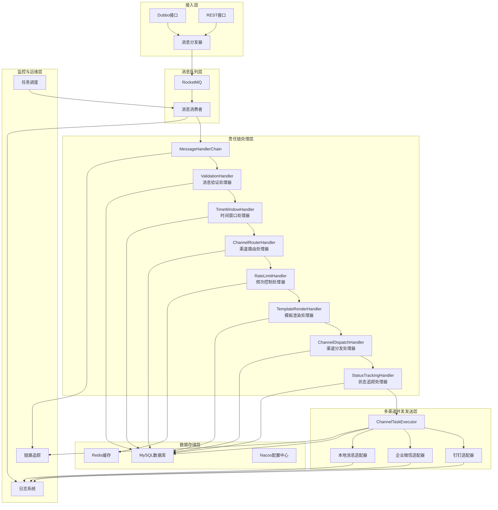
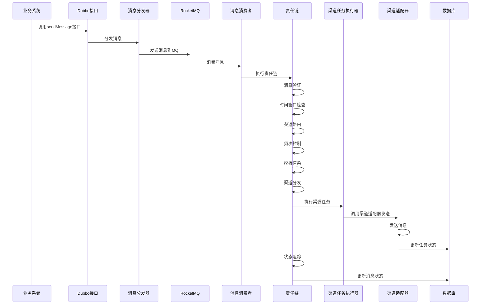
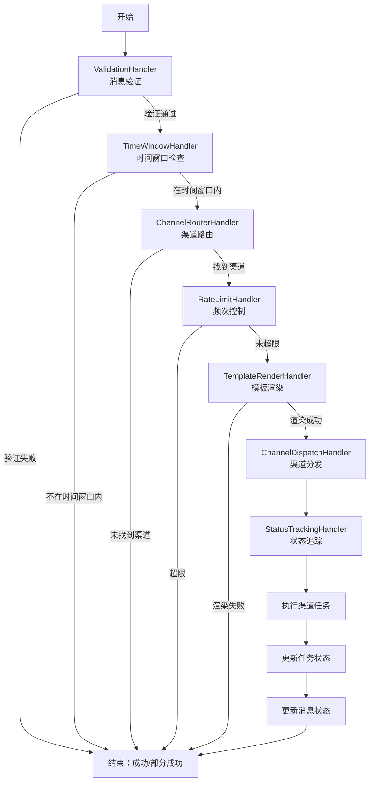
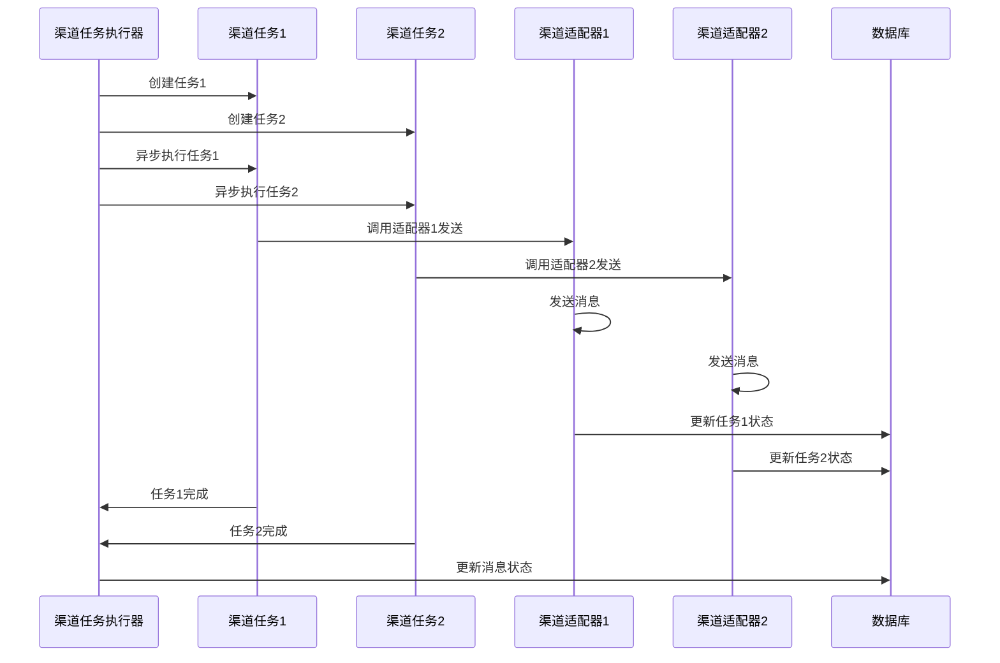
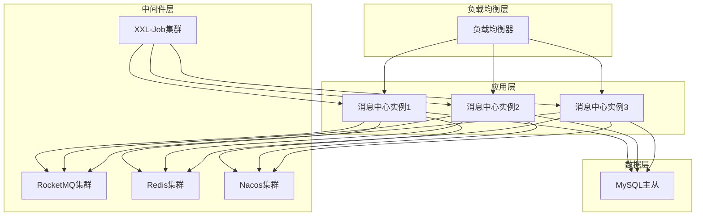

# 消息中心系统设计方案

## 1. 系统概述

### 1.1 系统定位

消息中心是一个通用的消息发送平台，提供统一的消息发送能力，支持多种消息类型和渠道，实现消息的高效、可靠发送。

### 1.2 核心价值

- **统一入口**：提供统一的Dubbo和REST接口，简化业务系统的消息发送流程
- **多渠道支持**：支持本地消息、钉钉、企业微信等多种渠道
- **灵活配置**：支持门店级和租户级两级配置，满足不同业务场景需求
- **模板化管理**：支持多种消息模板，实现消息内容的动态生成
- **可靠发送**：支持消息重试、状态追踪、故障隔离等机制，确保消息可靠送达
- **高性能**：采用消息队列、并发发送等机制，支持高并发消息处理

## 2. 系统架构设计

### 2.1 整体架构图



### 2.2 分层架构说明

| 层级 | 主要职责 | 核心组件 | 技术实现 |
|------|----------|----------|----------|
| 接入层 | 提供消息接入接口 | Dubbo接口、REST接口 | Spring Boot、Dubbo、Spring MVC |
| 消息队列层 | 实现消息的异步处理和解耦 | RocketMQ | RocketMQ |
| 责任链处理层 | 实现消息的全流程处理 | 各种消息处理器 | Spring Boot、责任链模式 |
| 多渠道并发发送层 | 实现多渠道消息的并发发送 | 渠道适配器、任务执行器 | 并发编程、适配器模式 |
| 数据存储层 | 存储消息、配置、任务等数据 | MySQL、Redis、Nacos | MySQL、Redis、Nacos |
| 监控与运维层 | 实现系统监控、日志、任务调度等 | 日志系统、链路追踪、任务调度 | Logback、SkyWalking、XXL-Job |

### 2.3 核心设计模式

- **责任链模式**：消息处理全流程采用责任链模式，便于扩展和维护
- **适配器模式**：不同渠道的发送逻辑通过适配器模式统一接口
- **策略模式**：同一渠道的不同消息类型采用策略模式处理
- **异步处理模式**：消息通过RocketMQ异步处理，提高系统吞吐量
- **并发模式**：多渠道消息并发发送，提高发送效率

## 3. 功能模块划分

### 3.1 消息接入模块

- **Dubbo接口**：提供统一的Dubbo接口，支持批量消息发送
- **REST接口**：提供REST HTTP接口，支持本地消息发送
- **消息分发器**：将接收到的消息分发到RocketMQ

### 3.2 消息处理模块

- **消息验证处理器**：验证消息的必填字段、格式等
- **时间窗口处理器**：检查消息是否在允许发送的时间窗口内
- **渠道路由处理器**：根据租户/门店配置路由到目标渠道
- **频次控制处理器**：检查各渠道的发送频次限制
- **模板渲染处理器**：根据业务数据和模板生成最终消息内容
- **渠道分发处理器**：将消息分发到各个渠道执行
- **状态追踪处理器**：追踪各渠道的发送状态

### 3.3 渠道发送模块

- **渠道适配器**：实现不同渠道的发送逻辑
  - 本地消息适配器
  - 钉钉适配器
  - 企业微信适配器
- **渠道任务执行器**：并发执行渠道发送任务，实现故障隔离

### 3.4 配置管理模块

- **渠道配置管理**：提供渠道配置的CRUD操作
- **模板配置管理**：提供消息模板的CRUD操作
- **系统配置管理**：管理系统级配置

### 3.5 消息管理模块

- **消息查询**：支持按条件查询消息
- **消息状态追踪**：追踪消息的发送状态
- **消息重试**：支持消息的自动重试

### 3.6 监控与运维模块

- **日志管理**：记录系统运行日志
- **链路追踪**：实现消息发送的全链路追踪
- **任务调度**：调度消息重试等定时任务

## 4. 数据结构设计

### 4.1 核心数据模型

#### 4.1.1 消息主表（msg_message）

| 字段名 | 数据类型 | 约束 | 描述 |
|--------|----------|------|------|
| id | BIGINT | PRIMARY KEY AUTO_INCREMENT | 主键ID |
| message_id | VARCHAR(64) | UNIQUE NOT NULL | 消息唯一ID |
| tenant_id | BIGINT | NOT NULL | 租户ID |
| store_id | BIGINT | NULL | 门店ID（空表示租户级） |
| business_type | VARCHAR(64) | NOT NULL | 业务类型 |
| business_data | JSON | NOT NULL | 业务数据JSON |
| target_channels | VARCHAR(255) | NULL | 目标渠道列表 |
| status | VARCHAR(20) | NOT NULL DEFAULT 'PENDING' | 消息状态：PENDING/PROCESSING/SUCCESS/PARTIAL_SUCCESS/FAILED |
| total_channels | INT | DEFAULT 0 | 总渠道数 |
| success_channels | INT | DEFAULT 0 | 成功渠道数 |
| failed_channels | INT | DEFAULT 0 | 失败渠道数 |
| create_time | DATETIME | NOT NULL DEFAULT CURRENT_TIMESTAMP | 创建时间 |
| update_time | DATETIME | DEFAULT CURRENT_TIMESTAMP ON UPDATE CURRENT_TIMESTAMP | 更新时间 |
| finish_time | DATETIME | NULL | 完成时间 |

**分区策略**：按create_time字段按月分区，保留最近12个月数据

#### 4.1.2 渠道任务表（msg_channel_task）

| 字段名 | 数据类型 | 约束 | 描述 |
|--------|----------|------|------|
| id | BIGINT | PRIMARY KEY AUTO_INCREMENT | 任务ID |
| message_id | VARCHAR(64) | NOT NULL | 消息ID |
| channel_type | VARCHAR(32) | NOT NULL | 渠道类型：DINGTALK/WECHAT_WORK/LOCAL |
| channel_config_id | BIGINT | NOT NULL | 渠道配置ID |
| rendered_content | TEXT | NULL | 渲染后的消息内容 |
| status | VARCHAR(20) | NOT NULL DEFAULT 'PENDING' | 任务状态：PENDING/SENDING/SUCCESS/FAILED/RETRY |
| retry_count | INT | DEFAULT 0 | 已重试次数 |
| max_retry | INT | DEFAULT 3 | 最大重试次数 |
| next_retry_time | DATETIME | NULL | 下次重试时间 |
| result_message | VARCHAR(500) | NULL | 发送结果消息 |
| third_party_response | TEXT | NULL | 第三方响应内容 |
| create_time | DATETIME | NOT NULL DEFAULT CURRENT_TIMESTAMP | 创建时间 |
| update_time | DATETIME | DEFAULT CURRENT_TIMESTAMP ON UPDATE CURRENT_TIMESTAMP | 更新时间 |
| finish_time | DATETIME | NULL | 完成时间 |

**分区策略**：按create_time字段按月分区，保留最近12个月数据

#### 4.1.3 渠道配置表（msg_channel_config）

| 字段名 | 数据类型 | 约束 | 描述 |
|--------|----------|------|------|
| id | BIGINT | PRIMARY KEY AUTO_INCREMENT | 配置ID |
| tenant_id | BIGINT | NOT NULL | 租户ID |
| store_id | BIGINT | NULL | 门店ID（空表示租户级） |
| channel_type | VARCHAR(32) | NOT NULL | 渠道类型：DINGTALK/WECHAT_WORK/LOCAL |
| channel_name | VARCHAR(64) | NOT NULL | 渠道名称 |
| config_json | TEXT | NOT NULL | 渠道配置JSON（认证信息、webhook等） |
| priority | INT | DEFAULT 1 | 优先级（数值越小优先级越高） |
| enabled | TINYINT | DEFAULT 1 | 是否启用 |
| rate_limit_count | INT | DEFAULT 100 | 频次限制数量 |
| rate_limit_window | INT | DEFAULT 60 | 频次限制时间窗口（秒） |
| rate_limit_unit | VARCHAR(10) | DEFAULT 'SECOND' | 时间单位：SECOND/MINUTE/HOUR/DAY |
| time_window_enabled | TINYINT | DEFAULT 0 | 是否启用时间窗口限制 |
| time_window_start_hour | INT | DEFAULT 0 | 允许发送开始时间（小时，0-23） |
| time_window_end_hour | INT | DEFAULT 23 | 允许发送结束时间（小时，0-23） |
| create_time | DATETIME | DEFAULT CURRENT_TIMESTAMP | 创建时间 |
| update_time | DATETIME | DEFAULT CURRENT_TIMESTAMP ON UPDATE CURRENT_TIMESTAMP | 更新时间 |

#### 4.1.4 消息模板表（msg_template）

| 字段名 | 数据类型 | 约束 | 描述 |
|--------|----------|------|------|
| id | BIGINT | PRIMARY KEY AUTO_INCREMENT | 模板ID |
| tenant_id | BIGINT | NOT NULL | 租户ID |
| business_type | VARCHAR(64) | NOT NULL | 业务类型 |
| channel_type | VARCHAR(32) | NOT NULL | 渠道类型：DINGTALK/WECHAT_WORK/LOCAL |
| message_type | VARCHAR(32) | NOT NULL | 消息类型：TEXT/MARKDOWN/CARD/LINK |
| template_name | VARCHAR(64) | NOT NULL | 模板名称 |
| template_content | TEXT | NOT NULL | 模板内容（使用${variableName}占位符） |
| enabled | TINYINT | DEFAULT 1 | 是否启用 |
| create_time | DATETIME | DEFAULT CURRENT_TIMESTAMP | 创建时间 |
| update_time | DATETIME | DEFAULT CURRENT_TIMESTAMP ON UPDATE CURRENT_TIMESTAMP | 更新时间 |

### 4.2 枚举类型

#### 4.2.1 渠道类型（ChannelType）

```java
public enum ChannelType {
    LOCAL("本地消息"),
    DINGTALK("钉钉"),
    WECHAT_WORK("企业微信");

    private final String desc;
}
```

#### 4.2.2 消息状态（MessageStatus）

```java
public enum MessageStatus {
    PENDING("待处理"),
    PROCESSING("处理中"),
    SUCCESS("全部成功"),
    PARTIAL_SUCCESS("部分成功"),
    FAILED("全部失败");

    private final String desc;
}
```

#### 4.2.3 任务状态（TaskStatus）

```java
public enum TaskStatus {
    PENDING("待发送"),
    SENDING("发送中"),
    SUCCESS("发送成功"),
    FAILED("发送失败"),
    RETRY("等待重试");

    private final String desc;
}
```

#### 4.2.4 消息类型（MessageType）

```java
public enum MessageType {
    TEXT("文本"),
    MARKDOWN("Markdown"),
    CARD("卡片"),
    LINK("链接");

    private final String desc;
}
```

## 5. 接口设计

### 5.1 Dubbo接口

#### 5.1.1 消息发送接口

```java
/**
 * 消息发送服务
 */
public interface MessageSendService {
    /**
     * 发送单条消息
     * @param message 消息对象
     * @return 发送结果
     */
    SendResult sendMessage(Message message);

    /**
     * 批量发送消息
     * @param messages 消息列表
     * @return 批量发送结果
     */
    BatchSendResult batchSendMessages(List<Message> messages);
}
```

#### 5.1.2 消息对象

```java
/**
 * 消息对象
 */
@Data
public class Message {
    /** 消息ID（可选，系统自动生成） */
    private String messageId;
    /** 租户ID */
    private Long tenantId;
    /** 门店ID（可选） */
    private Long storeId;
    /** 业务类型 */
    private String businessType;
    /** 业务数据（JSON格式） */
    private String businessData;
    /** 目标渠道列表（可选，不指定则使用配置的渠道） */
    private List<ChannelType> targetChannels;
    /** 扩展属性 */
    private Map<String, Object> attributes;
}
```

#### 5.1.3 发送结果

```java
/**
 * 发送结果
 */
@Data
public class SendResult {
    /** 是否成功 */
    private boolean success;
    /** 消息ID */
    private String messageId;
    /** 错误码 */
    private String errorCode;
    /** 错误信息 */
    private String errorMessage;
}

/**
 * 批量发送结果
 */
@Data
public class BatchSendResult {
    /** 总消息数 */
    private int totalCount;
    /** 成功数 */
    private int successCount;
    /** 失败数 */
    private int failedCount;
    /** 详细结果列表 */
    private List<SendResult> results;
}
```

### 5.2 REST接口

#### 5.2.1 消息发送接口

| 接口路径 | 方法 | 描述 | 请求体 | 响应体 |
|----------|------|------|--------|--------|
| /api/messages | POST | 发送单条消息 | Message对象 | SendResult |
| /api/messages/batch | POST | 批量发送消息 | List<Message> | BatchSendResult |
| /api/messages/{messageId} | GET | 查询消息详情 | - | MessageDetail |

#### 5.2.2 渠道配置接口

| 接口路径 | 方法 | 描述 | 请求体 | 响应体 |
|----------|------|------|--------|--------|
| /api/channel-configs | POST | 创建渠道配置 | ChannelConfig | ChannelConfig |
| /api/channel-configs | GET | 查询渠道配置列表 | - | PageResult<ChannelConfig> |
| /api/channel-configs/{id} | GET | 查询渠道配置详情 | - | ChannelConfig |
| /api/channel-configs/{id} | PUT | 更新渠道配置 | ChannelConfig | ChannelConfig |
| /api/channel-configs/{id} | DELETE | 删除渠道配置 | - | Boolean |

#### 5.2.3 模板配置接口

| 接口路径 | 方法 | 描述 | 请求体 | 响应体 |
|----------|------|------|--------|--------|
| /api/templates | POST | 创建消息模板 | MessageTemplate | MessageTemplate |
| /api/templates | GET | 查询消息模板列表 | - | PageResult<MessageTemplate> |
| /api/templates/{id} | GET | 查询消息模板详情 | - | MessageTemplate |
| /api/templates/{id} | PUT | 更新消息模板 | MessageTemplate | MessageTemplate |
| /api/templates/{id} | DELETE | 删除消息模板 | - | Boolean |

## 6. 交互流程设计

### 6.1 消息发送主流程



### 6.2 责任链处理流程



### 6.3 渠道并发发送流程



## 7. 异常处理机制

### 7.1 异常分类

| 异常类型 | 描述 | 处理方式 |
|----------|------|----------|
| 参数验证异常 | 消息参数不合法 | 返回错误结果，记录日志 |
| 配置异常 | 渠道或模板配置不存在 | 返回错误结果，记录日志 |
| 渠道异常 | 渠道发送失败 | 执行重试机制，更新状态 |
| 系统异常 | 系统内部错误 | 记录日志，返回错误结果 |

### 7.2 重试机制

- **重试策略**：采用指数退避重试策略
- **重试次数**：可配置，默认3次
- **重试间隔**：初始间隔60秒，每次重试间隔翻倍
- **重试条件**：仅对临时异常进行重试，如网络超时、服务不可用等
- **重试执行**：通过XXL-Job定时调度重试任务

### 7.3 故障隔离

- **独立执行**：每个渠道任务独立执行，互不影响
- **独立状态**：每个渠道维护独立的发送状态
- **独立重试**：每个渠道有独立的重试策略和计数
- **异常隔离**：一个渠道的异常不会传播到其他渠道

## 8. 性能优化策略

### 8.1 消息队列解耦

- 采用RocketMQ实现消息的异步处理和解耦
- 支持高并发消息发送，提高系统吞吐量

### 8.2 并发发送机制

- 采用CompletableFuture实现多渠道并发发送
- 可配置的线程池，优化并发性能

### 8.3 缓存优化

- 缓存渠道配置和模板，减少数据库查询
- 采用Redis实现频次控制，提高查询效率

### 8.4 数据库优化

- 采用分区表设计，提高查询性能
- 合理设计索引，优化查询效率
- 批量更新状态，减少数据库操作次数

### 8.5 异步处理

- 消息发送异步执行，提高响应速度
- 状态更新异步处理，减少同步等待

## 9. 技术栈实现

| 技术类别 | 技术栈 | 版本 | 用途 |
|----------|--------|------|------|
| 应用框架 | Spring Boot | 3.3.5 | 应用开发框架 |
| ORM框架 | MyBatis-Plus | 3.5.6 | 数据库访问 |
| 消息队列 | RocketMQ | 2.3.0 | 消息解耦和异步处理 |
| 分布式锁 | Redisson | 3.27.2 | 分布式锁和缓存 |
| 数据库连接池 | Druid | 1.2.21 | 数据库连接管理 |
| 数据库 | MySQL | 8.0 | 数据存储 |
| 缓存 | Redis | 6.0 | 缓存和频次控制 |
| RPC框架 | Dubbo | 3.3.0 | 远程服务调用 |
| 简化代码 | Lombok | 1.18.30 | 简化Java代码 |
| 工具类库 | Hutool | 5.7.22 | Java工具类 |
| 工具类库 | Guava | 31.1-jre | 谷歌工具类 |
| JSON处理 | Fastjson2 | 2.0.57 | JSON处理 |
| 任务调度 | XXL-Job | 3.0.0 | 分布式任务调度 |
| 微服务组件 | Spring Cloud | - | 微服务组件 |
| 配置中心 | Nacos | 2.x | 配置管理和服务注册 |
| 日志处理 | Logback | 1.2.3 | 日志管理 |
| 事件处理 | Disruptor | 3.4.2 | 高性能事件处理（日志） |
| 链路追踪 | SkyWalking | 9.0.0 | 链路追踪 |
| 分页插件 | PageHelper | 2.1.0 | 分页查询 |

## 10. 部署架构

### 10.1 部署图



### 10.2 部署建议

- 消息中心应用采用集群部署，提高可用性和性能
- RocketMQ、Redis、Nacos等中间件采用集群部署，确保高可用性
- MySQL采用主从架构，实现读写分离，提高性能
- 负载均衡器采用nginx或F5，实现请求的均匀分发

## 11. 监控与运维

### 11.1 日志管理

- 采用Logback实现日志管理
- 日志分级：DEBUG、INFO、WARN、ERROR
- 日志格式：包含时间、线程、级别、类名、日志内容等
- 日志存储：本地文件存储，定期归档

### 11.2 链路追踪

- 采用SkyWalking实现全链路追踪
- 追踪消息的完整发送流程，包括各个处理器的执行时间
- 支持根据消息ID查询完整链路

### 11.3 指标监控

- 监控系统的关键指标，如消息发送量、成功率、响应时间等
- 采用Prometheus+Grafana实现指标监控和可视化
- 设置告警规则，及时发现和处理异常

### 11.4 任务调度

- 采用XXL-Job实现消息重试等定时任务
- 支持任务的动态配置和监控

## 12. 安全设计

### 12.1 接口安全

- Dubbo接口采用令牌认证，确保接口调用安全
- REST接口采用JWT认证，防止未授权访问

### 12.2 数据安全

- 敏感配置信息加密存储
- 数据库连接采用SSL加密
- 日志中敏感信息脱敏

### 12.3 访问控制

- 基于租户ID的访问控制，确保数据隔离
- 角色权限管理，控制不同用户的操作权限

## 13. 扩展性设计

### 13.1 渠道扩展

- 采用适配器模式，新增渠道只需实现ChannelAdapter接口
- 支持动态加载渠道适配器，无需修改现有代码

### 13.2 处理器扩展

- 采用责任链模式，新增处理器只需实现MessageHandler接口
- 自动注册到责任链，按顺序执行

### 13.3 配置扩展

- 支持动态加载配置，无需重启服务
- 配置结构设计灵活，支持新增配置项

## 14. 测试策略

### 14.1 单元测试

- 对核心组件和工具类进行单元测试
- 测试覆盖率不低于80%

### 14.2 集成测试

- 测试各个模块之间的集成
- 测试消息的完整发送流程

### 14.3 性能测试

- 测试系统的并发处理能力
- 测试消息发送的响应时间
- 测试系统的稳定性和可靠性

### 14.4 压力测试

- 模拟高并发场景，测试系统的极限处理能力
- 测试系统在压力下的稳定性

## 15. 上线计划

### 15.1 灰度发布

- 采用灰度发布策略，逐步扩大用户范围
- 监控系统运行状态，及时发现和处理问题

### 15.2 回滚方案

- 制定详细的回滚方案，确保在出现问题时能够快速回滚
- 备份关键数据，确保数据安全

### 15.3 监控计划

- 上线后加强监控，重点关注系统的关键指标
- 安排专人值守，及时处理异常情况

## 16. 总结

消息中心系统是一个通用的消息发送平台，采用了先进的架构设计和技术栈，实现了消息的高效、可靠发送。该系统具有统一入口、多渠道支持、灵活配置、模板化管理、可靠发送、高性能等特点，能够满足各种业务场景的消息发送需求。

通过合理的架构设计、完善的异常处理机制、优化的性能策略，消息中心系统能够支持高并发、高可靠的消息发送，为业务系统提供稳定的消息发送服务。