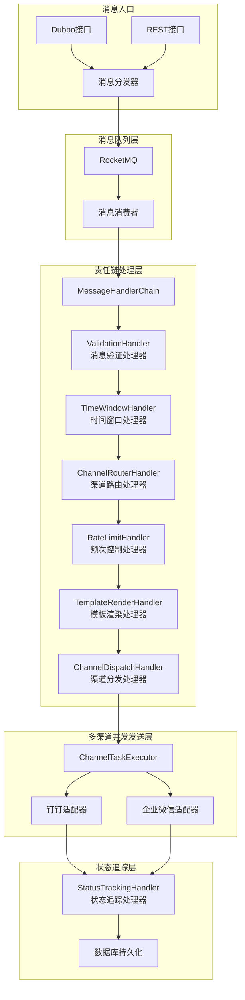
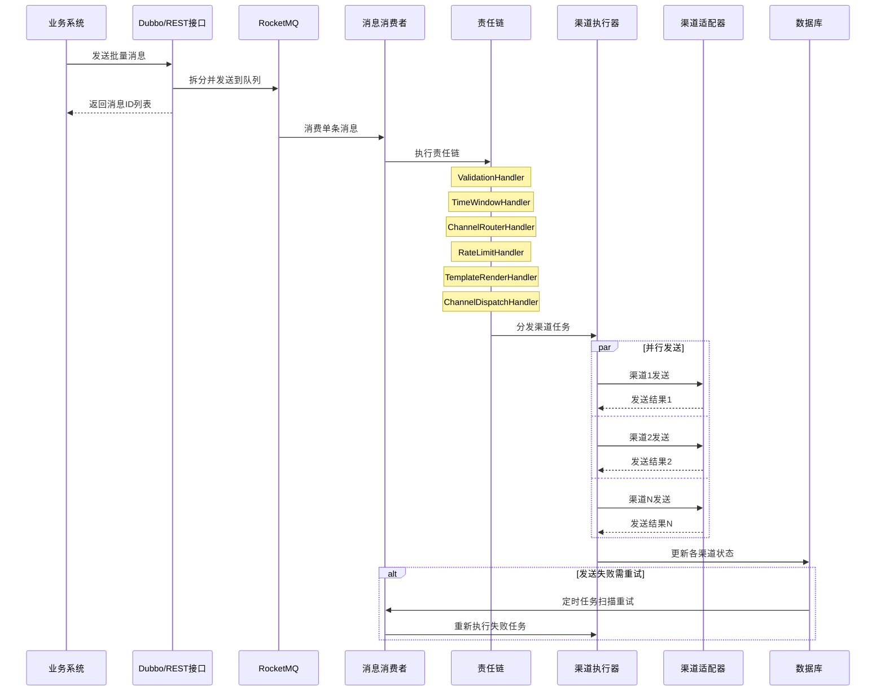
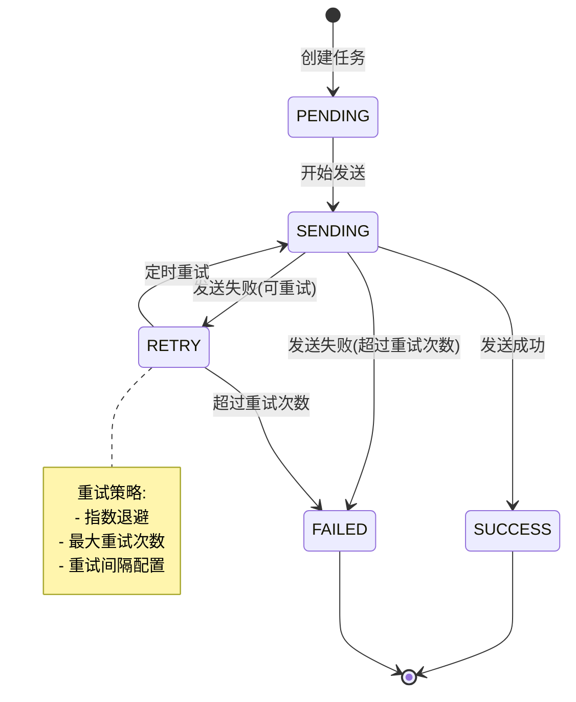
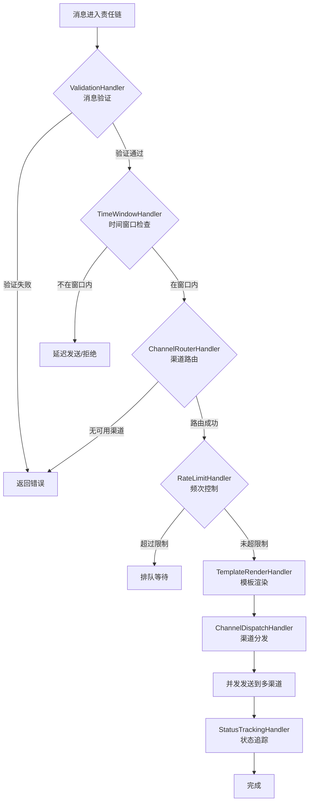

作为系统架构设计师，请为公司设计并实现一个通用的消息中心系统，提供统一的消息发送能力。请按照以下要求完成设计和开发工作：

## 一、核心功能需求

### 1. 消息类型支持

- **本地消息**：提供 REST HTTP 接口供前端系统调用
- **渠道消息**：支持钉钉、企业微信两种第三方渠道

### 2. 接口设计

- 设计统一的 Dubbo 接口作为消息入口
- 支持批量消息发送（单次可接收多条消息）
- 业务系统仅需提供：消息类型 + 消息内容（JSON 格式的业务数据）+ 目标渠道列表（可选）
- 渠道路由通过租户 ID 自动匹配配置实现
- **支持单条消息同时发送到多个渠道**

### 3. 渠道配置管理

- 支持两级配置：**门店级配置** 和 **租户级配置**
- 提供完整的 CRUD REST 接口供前端界面维护
- 配置内容包括：渠道类型、认证信息（钉钉/企业微信密钥）、webhook 地址、优先级、启用状态等
- **支持为消息配置多个发送渠道**

### 4. 消息模板管理

- 提供模板的 CRUD REST 接口供前端维护
- 模板配置维度：**业务类型 + 渠道类型 + 消息类型**（三维配置）
- 模板内容：使用占位符语法（如 ${variableName}）定义动态字段
- 模板解析：根据业务数据（JSON）+ 模板定义 → 构造最终消息体
- 支持钉钉和企业微信的所有消息类型（文本、markdown、卡片、链接等）

### 5. 消息发送策略

- **时间窗口策略**：配置允许发送的时间段（如工作时间 9:00-18:00）未配置就默认可以发送
- **渠道配置策略**：根据租户/门店配置动态选择发送渠道
- **频次控制**：按租户+渠道维度独立限制，支持灵活的时间窗口配置（秒/分钟/小时/天）
- **多渠道并发策略**：支持并行发送或按优先级顺序发送
- 策略处理采用**责任链模式**编排

### 6. 消息日志与重试

- 持久化所有消息记录到数据库，包含：
  - 原始业务数据
  - 匹配到的策略信息
  - 选择的渠道列表
  - 解析后的消息模板内容
  - **每个渠道的独立发送状态**和时间戳
- 支持可配置的重试机制（重试次数、重试间隔）
- 重试调用需要通过代理执行（注意注解配置）
- **单个渠道失败不影响其他渠道的发送（故障隔离）**

## 二、技术栈要求（后端实现）

- **Spring Boot 3.3.5**：应用框架
- **MyBatis-Plus 3.5.6**：ORM 框架
- **RocketMQ 2.3.0**：消息队列
- **Redisson 3.27.2**：分布式锁
- **Druid 1.2.21**：数据库连接池
- **MySQL 8.0**：关系型数据库
- **Redis 6.0**：缓存和分布式锁
- **Dubbo 3.3.0**：RPC 框架
- **Lombok 1.18.30**：简化 Java 代码
- **Hutool 5.7.22**：Java 工具类库
- **Guava 31.1-jre**：谷歌工具类库
- **Fastjson2 2.0.57**：JSON 处理
- **XXL-Job 3.0.0**：分布式任务调度
- **Spring Cloud**：微服务组件
- **Nacos 2.x**：配置中心和服务注册中心
- **Logback 1.2.3**：日志处理
- **Disruptor 3.4.2**：高性能事件处理框架，只处理日志
- **SkyWalking 9.0.0**：链路追踪
- **PageHelper 2.1.0**：分页插件

## 三、架构设计要求

### 1. DDD 领域驱动设计

- 采用单体应用架构
- 清晰划分领域层、应用层、基础设施层、接口层

### 2. 设计模式应用

- **消息解耦**：批量消息通过 RocketMQ 解耦，每条消息独立处理
- **责任链模式**：消息处理全流程采用责任链模式编排
- **适配器模式**：不同渠道（钉钉、企业微信、本地消息）的发送逻辑适配
- **策略模式**：同一渠道的不同消息类型（文本、卡片、markdown 等）处理

### 3. 配置管理与职责划分

#### 3.1 配置职责划分

消息中心的配置分为**系统级配置**和**租户级配置**，两者职责清晰、存储分离：

| 配置类型   | 存储位置                     | 配置范围            | 配置内容                     |
| ---------- | ---------------------------- | ------------------- | ---------------------------- |
| 系统级配置 | Nacos 配置中心               | 全局生效            | 重试策略、线程池、超时配置   |
| 租户级配置 | 数据库 msg_channel_config 表 | 按租户/门店维度生效 | 渠道配置、频次限制、时间窗口 |

**系统级配置（Nacos）**：

- 重试策略：`max-count`、`interval-seconds`、`backoff-multiplier`
- 线程池配置：`core-size`、`max-size`、`queue-capacity`
- 超时配置：`single-channel-seconds`、`all-channels-seconds`

**租户级配置（数据库）**：

- 渠道配置：渠道类型、webhook 地址、认证信息（`config_json` 字段）
- 频次限制：`rate_limit_count`、`rate_limit_window`、`rate_limit_unit`
- 时间窗口：`time_window_enabled`、`time_window_start_hour`、`time_window_end_hour`

#### 3.2 Nacos 使用说明

- **配置管理**：系统级全局配置（重试策略、线程池、超时）通过 Nacos 统一管理
- **动态刷新**：配置变更无需重启服务，实时生效
- **服务注册**：消息中心服务注册到 Nacos，支持服务发现和负载均衡
- **配置隔离**：支持多环境配置隔离（dev/test/prod）

#### 3.3 Nacos 配置示例

```yaml
# Nacos 配置：message-center.yaml
spring:
  cloud:
    nacos:
      discovery:
        server-addr: ${NACOS_SERVER:127.0.0.1:8848}
        namespace: ${NACOS_NAMESPACE:public}
      config:
        server-addr: ${NACOS_SERVER:127.0.0.1:8848}
        namespace: ${NACOS_NAMESPACE:public}
        file-extension: yaml
        refresh-enabled: true

# 消息中心系统配置（存储在 Nacos 配置中心）
# 注意：此处仅配置系统级全局配置，租户级配置（渠道、频次、时间窗口）请在数据库 msg_channel_config 表中配置
message-center:
  # 重试策略配置（系统级）
  retry:
    max-count: 3 # 最大重试次数
    interval-seconds: 60 # 重试间隔（秒）
    backoff-multiplier: 2 # 退避乘数

  # 线程池配置（系统级）
  thread-pool:
    core-size: 10 # 核心线程数
    max-size: 50 # 最大线程数
    queue-capacity: 1000 # 队列容量
    keep-alive-seconds: 60 # 线程存活时间

  # 超时配置（系统级）
  timeout:
    single-channel-seconds: 30 # 单渠道发送超时时间
    all-channels-seconds: 120 # 所有渠道总超时时间

# 配置职责说明：
# - 系统级配置（重试、线程池、超时）：仅从 Nacos 读取，全局生效
# - 租户级配置（渠道、频次限制、时间窗口）：仅从数据库 msg_channel_config 表读取，按租户/门店维度个性化
```

### 4. 数据库分区表设计

#### 4.1 分区表使用场景

消息中心的消息记录和渠道任务表数据量大、增长快，采用 **MySQL 分区表**（而非分库分表）方案：

- **按时间分区**：消息数据按创建时间进行 RANGE 分区，便于历史数据管理
- **查询性能优化**：分区裁剪（Partition Pruning）可显著提升按时间范围查询的性能
- **历史数据归档**：可快速删除或归档过期分区，无需逐行删除
- **运维简单**：无需额外中间件，原生 MySQL 支持

#### 4.2 分区策略说明

| 表名               | 分区类型 | 分区键      | 分区粒度 | 保留策略                     |
| ------------------ | -------- | ----------- | -------- | ---------------------------- |
| msg_message        | RANGE    | create_time | 按月分区 | 保留最近 12 个月             |
| msg_channel_task   | RANGE    | create_time | 按月分区 | 保留最近 12 个月             |
| msg_channel_config | 不分区   | -           | -        | 配置类表数据量小，不需要分区 |

### 5. 责任链模式架构设计

#### 5.1 整体架构图



#### 5.2 处理器（Handler）定义

##### 5.2.1 处理器接口定义

```java
/**
 * 消息处理器接口
 * 责任链模式的核心接口，所有处理器必须实现此接口
 */
public interface MessageHandler {

    /**
     * 处理消息
     * @param context 消息处理上下文，包含消息数据和处理状态
     * @return 处理结果
     */
    HandlerResult handle(MessageContext context);

    /**
     * 获取处理器顺序，数值越小优先级越高
     * @return 顺序值
     */
    int getOrder();

    /**
     * 获取处理器名称
     * @return 处理器名称
     */
    String getName();

    /**
     * 是否支持处理当前消息
     * @param context 消息处理上下文
     * @return true表示支持处理
     */
    boolean supports(MessageContext context);
}

/**
 * 消息处理上下文
 * 在责任链中传递，包含消息处理所需的所有数据
 */
@Data
public class MessageContext {
    /** 消息ID */
    private String messageId;
    /** 租户ID */
    private Long tenantId;
    /** 门店ID */
    private Long storeId;
    /** 业务类型 */
    private String businessType;
    /** 原始业务数据(JSON) */
    private String businessData;
    /** 目标渠道列表 */
    private List<ChannelType> targetChannels;
    /** 渠道配置列表 */
    private List<ChannelConfig> channelConfigs;
    /** 渲染后的消息内容(按渠道) */
    private Map<ChannelType, RenderedMessage> renderedMessages;
    /** 各渠道发送任务 */
    private List<ChannelTask> channelTasks;
    /** 处理状态 */
    private ProcessStatus status;
    /** 错误信息 */
    private String errorMessage;
    /** 扩展属性 */
    private Map<String, Object> attributes;
}

/**
 * 处理器执行结果
 */
@Data
public class HandlerResult {
    /** 是否继续执行下一个处理器 */
    private boolean continueChain;
    /** 是否处理成功 */
    private boolean success;
    /** 错误码 */
    private String errorCode;
    /** 错误信息 */
    private String errorMessage;

    public static HandlerResult success() {
        return new HandlerResult(true, true, null, null);
    }

    public static HandlerResult fail(String errorCode, String errorMessage) {
        return new HandlerResult(false, false, errorCode, errorMessage);
    }

    public static HandlerResult skip() {
        return new HandlerResult(true, true, null, "跳过当前处理器");
    }
}
```

##### 5.2.2 各处理器职责说明

| 处理器名称             | 顺序 | 职责                                                                 | 输入                                                     | 输出                                             |
| ---------------------- | ---- | -------------------------------------------------------------------- | -------------------------------------------------------- | ------------------------------------------------ |
| ValidationHandler      | 100  | 消息基础验证                                                         | 原始消息数据                                             | 验证结果（通过/失败）                            |
| TimeWindowHandler      | 200  | 检查发送时间窗口                                                     | 消息上下文、渠道配置（从数据库 msg_channel_config 读取） | 是否在允许发送时间内                             |
| ChannelRouterHandler   | 300  | 路由目标渠道                                                         | 租户/门店 ID、业务类型                                   | 目标渠道列表及配置                               |
| RateLimitHandler       | 400  | 检查各渠道的频次限制（按租户+渠道维度独立计数，基于 Redis 滑动窗口） | 租户 ID、渠道配置（从数据库 msg_channel_config 读取）    | 过滤后的可用渠道列表（超过频次限制的渠道被移除） |
| TemplateRenderHandler  | 500  | 渲染消息模板                                                         | 业务数据、模板配置                                       | 各渠道渲染后的消息内容                           |
| ChannelDispatchHandler | 600  | 分发到多渠道执行                                                     | 渲染后的消息、渠道列表                                   | 渠道发送任务列表                                 |
| StatusTrackingHandler  | 700  | 追踪各渠道发送状态                                                   | 发送结果                                                 | 持久化状态记录                                   |

##### 5.2.3 处理器实现示例

```java
/**
 * 消息验证处理器
 */
@Component
@Order(100)
public class ValidationHandler implements MessageHandler {

    @Override
    public HandlerResult handle(MessageContext context) {
        // 1. 验证必填字段
        if (StrUtil.isBlank(context.getBusinessType())) {
            return HandlerResult.fail("VALIDATION_ERROR", "业务类型不能为空");
        }
        if (StrUtil.isBlank(context.getBusinessData())) {
            return HandlerResult.fail("VALIDATION_ERROR", "业务数据不能为空");
        }

        // 2. 验证JSON格式
        if (!JSONUtil.isJson(context.getBusinessData())) {
            return HandlerResult.fail("VALIDATION_ERROR", "业务数据必须是有效的JSON格式");
        }

        // 3. 验证租户信息
        if (context.getTenantId() == null) {
            return HandlerResult.fail("VALIDATION_ERROR", "租户ID不能为空");
        }

        return HandlerResult.success();
    }

    @Override
    public int getOrder() { return 100; }

    @Override
    public String getName() { return "消息验证处理器"; }

    @Override
    public boolean supports(MessageContext context) { return true; }
}

/**
 * 渠道路由处理器
 */
@Component
@Order(300)
public class ChannelRouterHandler implements MessageHandler {

    @Autowired
    private ChannelConfigService channelConfigService;

    @Override
    public HandlerResult handle(MessageContext context) {
        // 1. 获取租户/门店的渠道配置
        List<ChannelConfig> configs = channelConfigService.getConfigs(
            context.getTenantId(),
            context.getStoreId(),
            context.getBusinessType()
        );

        if (CollUtil.isEmpty(configs)) {
            return HandlerResult.fail("NO_CHANNEL", "未配置可用的发送渠道");
        }

        // 2. 过滤启用的渠道
        List<ChannelConfig> enabledConfigs = configs.stream()
            .filter(ChannelConfig::isEnabled)
            .collect(Collectors.toList());

        // 3. 如果指定了目标渠道，进行过滤
        if (CollUtil.isNotEmpty(context.getTargetChannels())) {
            enabledConfigs = enabledConfigs.stream()
                .filter(c -> context.getTargetChannels().contains(c.getChannelType()))
                .collect(Collectors.toList());
        }

        context.setChannelConfigs(enabledConfigs);
        context.setTargetChannels(
            enabledConfigs.stream()
                .map(ChannelConfig::getChannelType)
                .collect(Collectors.toList())
        );

        return HandlerResult.success();
    }

    @Override
    public int getOrder() { return 300; }

    @Override
    public String getName() { return "渠道路由处理器"; }

    @Override
    public boolean supports(MessageContext context) { return true; }
}

/**
 * 频次控制处理器
 * 按租户+渠道维度进行独立的频次限制检查
 *
 * 设计原则：
 * - 租户隔离：每个租户的每个渠道维护独立的频次计数器，互不影响
 * - 灵活配置：支持不同的时间窗口（秒/分钟/小时/天）和限制数量
 * - 实现方式：基于 Redis 的计数器 + TTL 实现滑动时间窗口
 * - 配置来源：仅从数据库 msg_channel_config 表读取（租户级配置）
 * - Key 设计规则：rate_limit:{channelType}:{tenantId}:{storeId}:{timeWindow}
 *   示例1：rate_limit:DINGTALK:1001:2001:202512061430（按分钟，门店级）
 *   示例2：rate_limit:WECHAT_WORK:1001:null:20251206（按天，租户级）
 */
@Component
@Order(400)
public class RateLimitHandler implements MessageHandler {

    @Autowired
    private RedisTemplate<String, String> redisTemplate;

    @Autowired
    private ChannelConfigService channelConfigService;

    @Override
    public String getName() {
        return "频次控制处理器";
    }

    @Override
    public int getOrder() {
        return 400;
    }

    @Override
    public boolean supports(MessageContext context) {
        return context.getChannelConfigs() != null && !context.getChannelConfigs().isEmpty();
    }

    @Override
    public HandlerResult handle(MessageContext context) {
        List<ChannelConfig> allowedChannels = new ArrayList<>();

        for (ChannelConfig channel : context.getChannelConfigs()) {
            // 从数据库 msg_channel_config 表读取该渠道的频次限制配置
            RateLimitConfig rateLimitConfig = channelConfigService.getRateLimitConfig(
                context.getTenantId(),
                context.getStoreId(),
                channel.getChannelType()
            );

            // 构建 Redis Key（租户+渠道+时间窗口）
            String rateLimitKey = buildRateLimitKey(
                channel.getChannelType(),
                context.getTenantId(),
                context.getStoreId(),
                rateLimitConfig
            );

            // 检查当前时间窗口内的发送次数（原子递增）
            Long currentCount = redisTemplate.opsForValue().increment(rateLimitKey);

            // 首次计数时设置过期时间（等于时间窗口大小）
            if (currentCount == 1) {
                long ttlSeconds = convertToSeconds(
                    rateLimitConfig.getWindow(),
                    rateLimitConfig.getUnit()
                );
                redisTemplate.expire(rateLimitKey, ttlSeconds, TimeUnit.SECONDS);
            }

            // 判断是否超过限制
            if (currentCount <= rateLimitConfig.getCount()) {
                allowedChannels.add(channel);
                log.debug("租户[{}]的渠道[{}]频次检查通过，当前窗口已发送{}/{}条",
                    context.getTenantId(),
                    channel.getChannelType(),
                    currentCount,
                    rateLimitConfig.getCount());
            } else {
                log.warn("租户[{}]的渠道[{}]触发频次限制，当前窗口已发送{}条，限制{}条，该渠道将被跳过",
                    context.getTenantId(),
                    channel.getChannelType(),
                    currentCount,
                    rateLimitConfig.getCount());
            }
        }

        // 更新上下文中的可用渠道列表
        context.setChannelConfigs(allowedChannels);

        // 如果所有渠道都被限流，返回失败
        if (allowedChannels.isEmpty()) {
            return HandlerResult.fail("RATE_LIMITED", "所有渠道均触发频次限制，消息发送失败");
        }

        return HandlerResult.success();
    }

    /**
     * 构建频次限制的 Redis Key
     * 格式：rate_limit:{channelType}:{tenantId}:{storeId}:{timeWindow}
     */
    private String buildRateLimitKey(ChannelType channelType, Long tenantId,
                                     Long storeId, RateLimitConfig config) {
        String timeWindow = calculateTimeWindow(config.getWindow(), config.getUnit());
        String storeIdStr = storeId != null ? String.valueOf(storeId) : "null";
        return String.format("rate_limit:%s:%d:%s:%s",
            channelType, tenantId, storeIdStr, timeWindow);
    }

    /**
     * 根据时间单位计算当前时间窗口标识
     */
    private String calculateTimeWindow(Integer window, String unit) {
        LocalDateTime now = LocalDateTime.now();
        switch (unit) {
            case "SECOND":
                int secondSlot = now.getSecond() / window * window;
                return now.format(DateTimeFormatter.ofPattern("yyyyMMddHHmm")) + "_" + secondSlot;
            case "MINUTE":
                return now.format(DateTimeFormatter.ofPattern("yyyyMMddHHmm"));
            case "HOUR":
                return now.format(DateTimeFormatter.ofPattern("yyyyMMddHH"));
            case "DAY":
                return now.format(DateTimeFormatter.ofPattern("yyyyMMdd"));
            default:
                throw new IllegalArgumentException("不支持的时间单位: " + unit);
        }
    }

    /**
     * 将时间窗口配置转换为秒数（用于设置 Redis TTL）
     */
    private long convertToSeconds(Integer window, String unit) {
        switch (unit) {
            case "SECOND": return window;
            case "MINUTE": return window * 60L;
            case "HOUR":   return window * 3600L;
            case "DAY":    return window * 86400L;
            default: throw new IllegalArgumentException("不支持的时间单位: " + unit);
        }
    }
}

/**
 * 频次限制配置
 */
@Data
public class RateLimitConfig {
    /** 限制数量 */
    private Integer count;
    /** 时间窗口大小 */
    private Integer window;
    /** 时间单位：SECOND/MINUTE/HOUR/DAY */
    private String unit;
}

/**
 * 渠道分发处理器 - 支持多渠道并发发送
 */
@Component
@Order(600)
public class ChannelDispatchHandler implements MessageHandler {

    @Autowired
    private ChannelTaskExecutor channelTaskExecutor;

    @Override
    public HandlerResult handle(MessageContext context) {
        // 1. 为每个渠道创建发送任务
        List<ChannelTask> tasks = new ArrayList<>();
        for (ChannelConfig config : context.getChannelConfigs()) {
            ChannelTask task = new ChannelTask();
            task.setMessageId(context.getMessageId());
            task.setChannelType(config.getChannelType());
            task.setChannelConfig(config);
            task.setRenderedMessage(context.getRenderedMessages().get(config.getChannelType()));
            task.setStatus(TaskStatus.PENDING);
            task.setRetryCount(0);
            tasks.add(task);
        }

        context.setChannelTasks(tasks);

        // 2. 并发执行所有渠道任务
        channelTaskExecutor.executeAll(tasks);

        return HandlerResult.success();
    }

    @Override
    public int getOrder() { return 600; }

    @Override
    public String getName() { return "渠道分发处理器"; }

    @Override
    public boolean supports(MessageContext context) { return true; }
}
```

#### 5.3 责任链执行器

```java
/**
 * 责任链执行器
 * 负责按顺序执行所有处理器
 */
@Component
public class MessageHandlerChain {

    @Autowired
    private List<MessageHandler> handlers;

    @PostConstruct
    public void init() {
        // 按order排序
        handlers.sort(Comparator.comparingInt(MessageHandler::getOrder));
    }

    /**
     * 执行责任链
     */
    public ChainResult execute(MessageContext context) {
        ChainResult result = new ChainResult();
        result.setStartTime(LocalDateTime.now());

        for (MessageHandler handler : handlers) {
            // 检查是否支持处理
            if (!handler.supports(context)) {
                continue;
            }

            try {
                HandlerResult handlerResult = handler.handle(context);
                result.addHandlerResult(handler.getName(), handlerResult);

                // 如果处理失败或不继续执行，终止责任链
                if (!handlerResult.isContinueChain()) {
                    result.setSuccess(handlerResult.isSuccess());
                    result.setErrorMessage(handlerResult.getErrorMessage());
                    break;
                }
            } catch (Exception e) {
                result.setSuccess(false);
                result.setErrorMessage("处理器[" + handler.getName() + "]执行异常: " + e.getMessage());
                break;
            }
        }

        result.setEndTime(LocalDateTime.now());
        return result;
    }
}
```

#### 5.4 扩展责任链

##### 添加新处理器步骤：

1. **创建处理器类**：实现 `MessageHandler` 接口
2. **设置处理顺序**：通过 `getOrder()` 返回合适的顺序值
3. **注册到 Spring 容器**：添加 `@Component` 注解
4. **自动生效**：责任链执行器会自动发现并按顺序执行

##### 扩展示例 - 添加消息去重处理器：

```java
/**
 * 消息去重处理器
 * 插入到验证处理器之后、时间窗口处理器之前
 */
@Component
@Order(150)
public class DeduplicationHandler implements MessageHandler {

    @Autowired
    private RedissonClient redissonClient;

    @Override
    public HandlerResult handle(MessageContext context) {
        // 生成消息指纹
        String fingerprint = generateFingerprint(context);
        String key = "msg:dedup:" + fingerprint;

        // 检查是否重复
        RBucket<String> bucket = redissonClient.getBucket(key);
        if (bucket.isExists()) {
            return HandlerResult.fail("DUPLICATE_MESSAGE", "消息重复，已忽略");
        }

        // 记录指纹，设置过期时间
        bucket.set(context.getMessageId(), Duration.ofMinutes(5));

        return HandlerResult.success();
    }

    @Override
    public int getOrder() { return 150; }

    @Override
    public String getName() { return "消息去重处理器"; }

    @Override
    public boolean supports(MessageContext context) { return true; }
}
```

### 4. 核心流程设计

```
接收批量消息 → 发送到RocketMQ → 消费单条消息 → 责任链处理 →
    ├── ValidationHandler（验证）
    ├── TimeWindowHandler（时间窗口检查）
    ├── ChannelRouterHandler（路由渠道）
    ├── RateLimitHandler（频次控制）
    ├── TemplateRenderHandler（模板渲染）
    ├── ChannelDispatchHandler（多渠道分发）
    │       ├── 渠道任务1 → 适配器1 → 发送 → 状态更新
    │       ├── 渠道任务2 → 适配器2 → 发送 → 状态更新
    │       └── 渠道任务N → 适配器N → 发送 → 状态更新
    └── StatusTrackingHandler（状态汇总持久化）
```

## 四、多渠道并发发送机制

### 1. 渠道配置机制

#### 1.1 消息渠道配置示例

```json
{
  "messageId": "MSG202312060001",
  "tenantId": 1001,
  "storeId": 2001,
  "businessType": "ORDER_NOTIFY",
  "businessData": {
    "orderId": "ORD123456",
    "customerName": "张三",
    "amount": 199.0
  },
  "targetChannels": ["DINGTALK", "WECHAT_WORK"],
  "channelOptions": {
    "DINGTALK": {
      "priority": 1,
      "retryOnFail": true,
      "maxRetry": 3
    },
    "WECHAT_WORK": {
      "priority": 1,
      "retryOnFail": true,
      "maxRetry": 3
    }
  }
}
```

#### 1.2 数据库字符集设计

##### 字符集选择说明

| 配置项   | 选择          | 说明                                                                                                                               |
| -------- | ------------- | ---------------------------------------------------------------------------------------------------------------------------------- |
| 字符集   | `utf8mb4`     | MySQL 的 `utf8` 仅支持最多 3 字节的 UTF-8 字符，无法存储 emoji 等 4 字节字符。`utf8mb4` 是完整的 UTF-8 实现，支持所有 Unicode 字符 |
| 排序规则 | `utf8mb4_bin` | 二进制排序，区分大小写，适用于需要精确匹配的场景（如渠道类型、消息 ID、状态值等）                                                  |

##### 区分大小写的字段

以下字段使用 `utf8mb4_bin` 排序规则后将区分大小写：

- `channel_type`：渠道类型（DINGTALK、WECHAT_WORK）
- `message_id`：消息唯一 ID
- `business_type`：业务类型
- `status`：状态值（PENDING、SUCCESS、FAILED 等）
- `rate_limit_unit`：时间单位（SECOND、MINUTE、HOUR、DAY）

##### 设计理由

1. **数据一致性**：避免因大小写不敏感导致的数据混乱（如 `DINGTALK` 和 `dingtalk` 被视为相同）
2. **查询效率**：二进制比较比字符串比较更高效
3. **兼容性**：确保与 Java 代码中的枚举值精确匹配

#### 1.3 租户渠道配置表结构

```sql
CREATE TABLE msg_channel_config (
    id BIGINT PRIMARY KEY AUTO_INCREMENT,
    tenant_id BIGINT NOT NULL COMMENT '租户ID',
    store_id BIGINT DEFAULT NULL COMMENT '门店ID（空表示租户级配置）',
    channel_type VARCHAR(32) NOT NULL COMMENT '渠道类型：DINGTALK/WECHAT_WORK',
    channel_name VARCHAR(64) NOT NULL COMMENT '渠道名称',
    config_json TEXT NOT NULL COMMENT '渠道配置JSON（认证信息、webhook等）',
    priority INT DEFAULT 1 COMMENT '优先级（数值越小优先级越高）',
    enabled TINYINT DEFAULT 1 COMMENT '是否启用',
    -- 频次限制配置
    rate_limit_count INT DEFAULT 100 COMMENT '频次限制数量',
    rate_limit_window INT DEFAULT 60 COMMENT '频次限制时间窗口（秒）',
    rate_limit_unit VARCHAR(10) DEFAULT 'SECOND' COMMENT '时间单位：SECOND/MINUTE/HOUR/DAY',
    -- 时间窗口配置
    time_window_enabled TINYINT DEFAULT 0 COMMENT '是否启用时间窗口限制（0-不限制，1-限制）',
    time_window_start_hour INT DEFAULT 0 COMMENT '允许发送开始时间（小时，0-23）',
    time_window_end_hour INT DEFAULT 23 COMMENT '允许发送结束时间（小时，0-23）',
    create_time DATETIME DEFAULT CURRENT_TIMESTAMP,
    update_time DATETIME DEFAULT CURRENT_TIMESTAMP ON UPDATE CURRENT_TIMESTAMP,
    INDEX idx_tenant_store (tenant_id, store_id),
    INDEX idx_channel_type (channel_type)
) ENGINE=InnoDB DEFAULT CHARSET=utf8mb4 COLLATE=utf8mb4_bin COMMENT='渠道配置表';
```

#### 1.4 消息主表结构（分区表）

```sql
-- 消息主表（按月分区）
CREATE TABLE msg_message (
    id BIGINT NOT NULL AUTO_INCREMENT,
    message_id VARCHAR(64) NOT NULL COMMENT '消息唯一ID',
    tenant_id BIGINT NOT NULL COMMENT '租户ID',
    store_id BIGINT DEFAULT NULL COMMENT '门店ID',
    business_type VARCHAR(64) NOT NULL COMMENT '业务类型',
    business_data JSON COMMENT '业务数据JSON',
    target_channels VARCHAR(255) COMMENT '目标渠道列表',
    status VARCHAR(20) NOT NULL DEFAULT 'PENDING' COMMENT '消息状态：PENDING/PROCESSING/SUCCESS/PARTIAL_SUCCESS/FAILED',
    total_channels INT DEFAULT 0 COMMENT '总渠道数',
    success_channels INT DEFAULT 0 COMMENT '成功渠道数',
    failed_channels INT DEFAULT 0 COMMENT '失败渠道数',
    create_time DATETIME NOT NULL DEFAULT CURRENT_TIMESTAMP COMMENT '创建时间（分区键）',
    update_time DATETIME DEFAULT CURRENT_TIMESTAMP ON UPDATE CURRENT_TIMESTAMP,
    finish_time DATETIME COMMENT '完成时间',
    PRIMARY KEY (id, create_time),  -- 分区表主键必须包含分区键
    UNIQUE KEY uk_message_id (message_id, create_time),
    INDEX idx_tenant_store (tenant_id, store_id),
    INDEX idx_business_type (business_type),
    INDEX idx_status (status),
    INDEX idx_create_time (create_time)
) ENGINE=InnoDB DEFAULT CHARSET=utf8mb4 COLLATE=utf8mb4_bin COMMENT='消息主表'
PARTITION BY RANGE (TO_DAYS(create_time)) (
    PARTITION p202501 VALUES LESS THAN (TO_DAYS('2025-02-01')),
    PARTITION p202502 VALUES LESS THAN (TO_DAYS('2025-03-01')),
    PARTITION p202503 VALUES LESS THAN (TO_DAYS('2025-04-01')),
    PARTITION p202504 VALUES LESS THAN (TO_DAYS('2025-05-01')),
    PARTITION p202505 VALUES LESS THAN (TO_DAYS('2025-06-01')),
    PARTITION p202506 VALUES LESS THAN (TO_DAYS('2025-07-01')),
    PARTITION p202507 VALUES LESS THAN (TO_DAYS('2025-08-01')),
    PARTITION p202508 VALUES LESS THAN (TO_DAYS('2025-09-01')),
    PARTITION p202509 VALUES LESS THAN (TO_DAYS('2025-10-01')),
    PARTITION p202510 VALUES LESS THAN (TO_DAYS('2025-11-01')),
    PARTITION p202511 VALUES LESS THAN (TO_DAYS('2025-12-01')),
    PARTITION p202512 VALUES LESS THAN (TO_DAYS('2026-01-01')),
    PARTITION p_future VALUES LESS THAN MAXVALUE  -- 兜底分区
);
```

### 2. 渠道任务独立处理与状态追踪

#### 2.1 渠道任务模型

```java
/**
 * 渠道发送任务
 * 每个渠道独立的发送任务，支持独立状态追踪
 */
@Data
@TableName("msg_channel_task")
public class ChannelTask {
    /** 任务ID */
    private Long id;
    /** 消息ID */
    private String messageId;
    /** 渠道类型 */
    private ChannelType channelType;
    /** 渠道配置ID */
    private Long channelConfigId;
    /** 渲染后的消息内容 */
    private String renderedContent;
    /** 任务状态：PENDING/SENDING/SUCCESS/FAILED/RETRY */
    private TaskStatus status;
    /** 已重试次数 */
    private Integer retryCount;
    /** 最大重试次数 */
    private Integer maxRetry;
    /** 下次重试时间 */
    private LocalDateTime nextRetryTime;
    /** 发送结果 */
    private String resultMessage;
    /** 第三方响应 */
    private String thirdPartyResponse;
    /** 创建时间 */
    private LocalDateTime createTime;
    /** 更新时间 */
    private LocalDateTime updateTime;
    /** 完成时间 */
    private LocalDateTime finishTime;
}

/**
 * 任务状态枚举
 */
public enum TaskStatus {
    PENDING("待发送"),
    SENDING("发送中"),
    SUCCESS("发送成功"),
    FAILED("发送失败"),
    RETRY("等待重试"),
    CANCELLED("已取消");

    private final String desc;
}
```

#### 2.2 渠道任务表结构（分区表）

```sql
-- 渠道发送任务表（按月分区）
CREATE TABLE msg_channel_task (
    id BIGINT NOT NULL AUTO_INCREMENT,
    message_id VARCHAR(64) NOT NULL COMMENT '消息ID',
    channel_type VARCHAR(32) NOT NULL COMMENT '渠道类型',
    channel_config_id BIGINT NOT NULL COMMENT '渠道配置ID',
    rendered_content TEXT COMMENT '渲染后的消息内容',
    status VARCHAR(20) NOT NULL DEFAULT 'PENDING' COMMENT '状态：PENDING/SENDING/SUCCESS/FAILED/RETRY',
    retry_count INT DEFAULT 0 COMMENT '已重试次数',
    max_retry INT DEFAULT 3 COMMENT '最大重试次数',
    next_retry_time DATETIME COMMENT '下次重试时间',
    result_message VARCHAR(500) COMMENT '发送结果消息',
    third_party_response TEXT COMMENT '第三方响应内容',
    create_time DATETIME NOT NULL DEFAULT CURRENT_TIMESTAMP COMMENT '创建时间（分区键）',
    update_time DATETIME DEFAULT CURRENT_TIMESTAMP ON UPDATE CURRENT_TIMESTAMP,
    finish_time DATETIME COMMENT '完成时间',
    PRIMARY KEY (id, create_time),  -- 分区表主键必须包含分区键
    INDEX idx_message_id (message_id),
    INDEX idx_status (status),
    INDEX idx_next_retry (next_retry_time),
    INDEX idx_create_time (create_time)
) ENGINE=InnoDB DEFAULT CHARSET=utf8mb4 COLLATE=utf8mb4_bin COMMENT='渠道发送任务表'
PARTITION BY RANGE (TO_DAYS(create_time)) (
    PARTITION p202501 VALUES LESS THAN (TO_DAYS('2025-02-01')),
    PARTITION p202502 VALUES LESS THAN (TO_DAYS('2025-03-01')),
    PARTITION p202503 VALUES LESS THAN (TO_DAYS('2025-04-01')),
    PARTITION p202504 VALUES LESS THAN (TO_DAYS('2025-05-01')),
    PARTITION p202505 VALUES LESS THAN (TO_DAYS('2025-06-01')),
    PARTITION p202506 VALUES LESS THAN (TO_DAYS('2025-07-01')),
    PARTITION p202507 VALUES LESS THAN (TO_DAYS('2025-08-01')),
    PARTITION p202508 VALUES LESS THAN (TO_DAYS('2025-09-01')),
    PARTITION p202509 VALUES LESS THAN (TO_DAYS('2025-10-01')),
    PARTITION p202510 VALUES LESS THAN (TO_DAYS('2025-11-01')),
    PARTITION p202511 VALUES LESS THAN (TO_DAYS('2025-12-01')),
    PARTITION p202512 VALUES LESS THAN (TO_DAYS('2026-01-01')),
    PARTITION p_future VALUES LESS THAN MAXVALUE  -- 兜底分区
);

-- 分区管理示例
-- 添加新分区（每月执行一次）
-- ALTER TABLE msg_channel_task ADD PARTITION (
--     PARTITION p202601 VALUES LESS THAN (TO_DAYS('2026-02-01'))
-- );

-- 删除历史分区（归档后执行）
-- ALTER TABLE msg_channel_task DROP PARTITION p202501;
```

### 3. 故障隔离机制

#### 3.1 设计原则

- **独立执行**：每个渠道任务独立执行，互不影响
- **独立状态**：每个渠道维护独立的发送状态
- **独立重试**：每个渠道有独立的重试策略和计数
- **异常隔离**：一个渠道的异常不会传播到其他渠道

#### 3.2 实现代码

```java
/**
 * 渠道任务执行器
 * 支持多渠道并发执行，实现故障隔离
 */
@Component
public class ChannelTaskExecutor {

    @Autowired
    private Map<ChannelType, ChannelAdapter> adapterMap;

    @Autowired
    private ChannelTaskRepository taskRepository;

    @Autowired
    private ThreadPoolTaskExecutor taskExecutor;

    /**
     * 并发执行所有渠道任务
     * 每个任务独立执行，互不影响
     */
    public void executeAll(List<ChannelTask> tasks) {
        // 使用CompletableFuture并发执行所有任务
        List<CompletableFuture<Void>> futures = tasks.stream()
            .map(task -> CompletableFuture.runAsync(() -> executeTask(task), taskExecutor))
            .collect(Collectors.toList());

        // 等待所有任务完成（可选择设置超时）
        CompletableFuture.allOf(futures.toArray(new CompletableFuture[0]))
            .exceptionally(ex -> {
                log.error("部分渠道任务执行失败", ex);
                return null;
            });
    }

    /**
     * 执行单个渠道任务
     * 包含完整的错误处理和状态追踪
     */
    private void executeTask(ChannelTask task) {
        try {
            // 更新状态为发送中
            task.setStatus(TaskStatus.SENDING);
            taskRepository.updateStatus(task);

            // 获取对应的渠道适配器
            ChannelAdapter adapter = adapterMap.get(task.getChannelType());
            if (adapter == null) {
                throw new ChannelException("不支持的渠道类型: " + task.getChannelType());
            }

            // 执行发送
            SendResult result = adapter.send(task);

            // 更新发送结果
            if (result.isSuccess()) {
                task.setStatus(TaskStatus.SUCCESS);
                task.setResultMessage("发送成功");
            } else {
                handleFailure(task, result.getErrorMessage());
            }
        } catch (Exception e) {
            // 异常处理 - 不影响其他渠道
            handleFailure(task, e.getMessage());
        } finally {
            task.setUpdateTime(LocalDateTime.now());
            if (task.getStatus() == TaskStatus.SUCCESS ||
                task.getStatus() == TaskStatus.FAILED) {
                task.setFinishTime(LocalDateTime.now());
            }
            taskRepository.update(task);
        }
    }

    /**
     * 处理发送失败
     */
    private void handleFailure(ChannelTask task, String errorMessage) {
        task.setResultMessage(errorMessage);

        // 判断是否需要重试
        if (task.getRetryCount() < task.getMaxRetry()) {
            task.setStatus(TaskStatus.RETRY);
            task.setRetryCount(task.getRetryCount() + 1);
            // 计算下次重试时间（指数退避）
            int delay = (int) Math.pow(2, task.getRetryCount()) * 60;
            task.setNextRetryTime(LocalDateTime.now().plusSeconds(delay));
        } else {
            task.setStatus(TaskStatus.FAILED);
        }
    }
}
```

### 4. 执行策略

#### 4.1 默认行为说明

多渠道发送默认就是**异步并发执行**（基于 CompletableFuture），所有渠道同时发送互不阻塞。以下两种策略是对默认并发行为的特殊控制：

| 策略       | 说明                                         | 适用场景                   |
| ---------- | -------------------------------------------- | -------------------------- |
| SEQUENTIAL | 顺序执行，按配置顺序依次发送                 | 需要严格控制发送顺序的场景 |
| PRIORITY   | 优先级执行，高优先级先发送，同优先级并行发送 | 需要按优先级分批发送的场景 |

#### 4.2 策略配置

```yaml
message-center:
  channel:
    # 执行模式：SEQUENTIAL(顺序) / PRIORITY(优先级)，不配置则默认异步并发执行
    execution-mode: PRIORITY
    # 并行执行的线程池配置
    thread-pool:
      core-size: 10
      max-size: 50
      queue-capacity: 1000
      keep-alive-seconds: 60
    # 超时配置
    timeout:
      single-channel-seconds: 30
      all-channels-seconds: 120
    # 优先级模式配置
    priority:
      # 高优先级渠道失败后是否继续低优先级
      continue-on-fail: true
      # 高优先级成功后是否跳过低优先级
      skip-on-success: false
```

#### 4.3 执行策略实现

```java
/**
 * 渠道执行策略接口
 */
public interface ChannelExecutionStrategy {
    void execute(List<ChannelTask> tasks);
}

/**
 * 默认并发执行器（无需特殊策略配置时使用）
 * 所有渠道异步并发执行，互不阻塞
 */
@Component
public class DefaultChannelExecutor {

    @Autowired
    private ThreadPoolTaskExecutor channelExecutorPool;

    public void executeAll(List<ChannelTask> tasks) {
        // 默认并发执行所有渠道任务
        CompletableFuture.allOf(
            tasks.stream()
                .map(task -> CompletableFuture.runAsync(
                    () -> executeTask(task), channelExecutorPool))
                .toArray(CompletableFuture[]::new)
        ).join();
    }
}

/**
 * 优先级执行策略
 * 按优先级分组执行，高优先级先执行，同优先级任务并行执行
 */
@Component
@ConditionalOnProperty(name = "message-center.channel.execution-mode", havingValue = "PRIORITY")
public class PriorityExecutionStrategy implements ChannelExecutionStrategy {

    @Value("${message-center.channel.priority.continue-on-fail:true}")
    private boolean continueOnFail;

    @Value("${message-center.channel.priority.skip-on-success:false}")
    private boolean skipOnSuccess;

    @Override
    public void execute(List<ChannelTask> tasks) {
        // 按优先级分组
        Map<Integer, List<ChannelTask>> groupedByPriority = tasks.stream()
            .collect(Collectors.groupingBy(t -> t.getChannelConfig().getPriority()));

        // 按优先级顺序执行（数值越小优先级越高）
        List<Integer> priorities = new ArrayList<>(groupedByPriority.keySet());
        Collections.sort(priorities);

        boolean hasSuccess = false;
        for (Integer priority : priorities) {
            // 如果高优先级已成功且配置跳过，则停止
            if (hasSuccess && skipOnSuccess) {
                break;
            }

            List<ChannelTask> samePriorityTasks = groupedByPriority.get(priority);
            // 同优先级的任务并行执行
            List<Boolean> results = executeParallel(samePriorityTasks);

            hasSuccess = results.stream().anyMatch(r -> r);

            // 如果全部失败且不继续，则停止
            if (!hasSuccess && !continueOnFail) {
                break;
            }
        }
    }
}

/**
 * 顺序执行策略
 * 按配置顺序依次发送，前一个完成后再发送下一个
 */
@Component
@ConditionalOnProperty(name = "message-center.channel.execution-mode", havingValue = "SEQUENTIAL")
public class SequentialExecutionStrategy implements ChannelExecutionStrategy {

    @Override
    public void execute(List<ChannelTask> tasks) {
        // 按顺序依次执行
        for (ChannelTask task : tasks) {
            executeTask(task);
        }
    }
}
```

## 五、关键技术难点

### 1. 模板设计与解析

- **模板语法**：定义占位符规则（建议使用 ${key} 或 #{key} 语法）
- **模板约束**：每种消息类型的必填字段校验（如钉钉卡片消息必须有 title）
- **模板解析引擎**：根据业务 JSON 数据 + 模板定义 → 生成最终消息体
- **多类型支持**：需要为钉钉和企业微信的每种消息类型设计对应的模板结构

### 2. 渠道消息类型映射

- 钉钉支持：text、link、markdown、actionCard、feedCard 等
- 企业微信支持：text、markdown、image、news、file 等
- 需要设计统一的模板配置表结构，支持不同渠道的不同消息类型

### 3. 业务无关性

- 消息中心不关心业务逻辑，仅负责消息分发
- 通过 JSON 模型 + 模板配置实现业务数据到消息的转换

## 六、扩展性设计

### 1. 添加新的消息处理器

#### 1.1 扩展步骤

1. **创建处理器类**：实现 `MessageHandler` 接口
2. **确定处理顺序**：根据业务需求选择合适的 `order` 值
3. **实现处理逻辑**：在 `handle()` 方法中实现具体逻辑
4. **添加 Spring 注解**：使用 `@Component` 注册到容器
5. **自动生效**：责任链执行器自动发现并按顺序执行

#### 1.2 常见扩展场景

| 场景         | 建议顺序 | 说明             |
| ------------ | -------- | ---------------- |
| 消息签名验证 | 110      | 在基础验证后进行 |
| 消息去重     | 150      | 防止重复发送     |
| 黑名单过滤   | 180      | 过滤特定接收者   |
| 消息加密     | 550      | 模板渲染后加密   |
| 消息压缩     | 580      | 大消息压缩处理   |
| 发送统计     | 650      | 分发后统计埋点   |

### 2. 接入新的发送渠道

#### 2.1 扩展步骤

1. **创建渠道适配器**：实现 `ChannelAdapter` 接口

```java
/**
 * 渠道适配器接口
 */
public interface ChannelAdapter {

    /**
     * 获取渠道类型
     */
    ChannelType getChannelType();

    /**
     * 发送消息
     */
    SendResult send(ChannelTask task);

    /**
     * 验证渠道配置
     */
    boolean validateConfig(ChannelConfig config);
}

/**
 * 钉钉渠道适配器示例
 */
@Component
public class DingTalkChannelAdapter implements ChannelAdapter {

    @Autowired
    private DingTalkClient dingTalkClient;

    @Override
    public ChannelType getChannelType() {
        return ChannelType.DINGTALK;
    }

    @Override
    public SendResult send(ChannelTask task) {
        // 1. 获取渠道配置
        DingTalkConfig config = parseConfig(task.getChannelConfig());

        // 2. 构建请求消息
        DingTalkMessage message = buildMessage(task.getRenderedContent(), task.getMessageType());

        // 3. 调用钉钉API
        DingTalkResponse response = dingTalkClient.send(config.getWebhook(), config.getSecret(), message);

        // 4. 返回结果
        return response.isSuccess()
            ? SendResult.success()
            : SendResult.fail(response.getErrCode(), response.getErrMsg());
    }

    @Override
    public boolean validateConfig(ChannelConfig config) {
        DingTalkConfig dingTalkConfig = parseConfig(config);
        return StrUtil.isNotBlank(dingTalkConfig.getWebhook());
    }
}
```

2. **渠道类型枚举定义**

```java
public enum ChannelType {
    DINGTALK("钉钉"),
    WECHAT_WORK("企业微信");

    private final String desc;

    ChannelType(String desc) {
        this.desc = desc;
    }

    public String getDesc() {
        return desc;
    }
}
```

3. **配置渠道模板**：为钉钉或企业微信渠道配置消息模板

4. **自动注册**：适配器通过 Spring 自动注入到 `adapterMap`

### 3. 系统可配置性

#### 3.1 配置中心集成

```yaml
message-center:
  # 责任链处理器配置
  handler:
    # 启用/禁用特定处理器
    enabled:
      validation: true
      time-window: true
      rate-limit: true
      deduplication: false
    # 处理器超时配置
    timeout:
      default-seconds: 10
      template-render-seconds: 5

  # 渠道发送配置（系统级）
  channel:
    # 重试策略
    retry:
      max-count: 3
      interval-seconds: 60
      backoff-multiplier: 2
    # 超时配置
    timeout:
      single-channel-seconds: 30
      all-channels-seconds: 120
    # 注意：渠道认证信息、频次限制、时间窗口等租户级配置请在数据库 msg_channel_config 表中配置

  # 消息队列配置
  mq:
    topic: message-center-topic
    consumer-group: message-center-group
    batch-size: 16

  # 线程池配置
  thread-pool:
    core-size: 10
    max-size: 50
    queue-capacity: 1000
```

#### 3.2 动态配置支持

**系统级配置（Nacos）**：

- 通过 Nacos 配置中心动态修改，无需重启服务
- 使用 `@RefreshScope` 注解实现配置热更新
- 重试策略、线程池、超时配置可动态调整
- 支持配置版本管理和回滚

**租户级配置（数据库）**：

- 通过管理后台或 API 修改数据库配置，实时生效
- 渠道配置、频次限制、时间窗口按租户/门店维度独立配置
- 配置变更立即对新消息生效，无需重启服务

## 七、消息处理流程图

### 1. 完整消息发送流程



### 2. 渠道任务状态流转



### 3. 责任链处理流程



## 八、交付物要求

### 1. 详细设计文档（优先输出）

包含以下章节：

- 系统架构设计（整体架构图、模块划分、技术选型说明）
- 领域模型设计（DDD 分层、核心领域对象、聚合根定义）
- 数据库设计（ER 图、表结构说明、索引设计）
- 接口设计（Dubbo 接口、REST 接口的详细定义）
- 核心流程设计（消息发送流程、模板解析流程、重试流程）
- 模板设计方案（模板语法、解析引擎、约束规则、示例）
- **责任链设计**（各处理器说明、接口定义、执行顺序、扩展方式）
- **多渠道发送设计**（渠道配置、并发执行、状态追踪、故障隔离）
- 适配器设计（各渠道适配器实现方案）
- 非功能性设计（性能、可用性、可扩展性）

### 2. 数据库脚本

- 完整的建表 SQL（包含注释、索引、约束）
- **渠道配置表和渠道任务表**
- 测试数据填充 SQL（包含各种场景的示例数据）

### 3. 完整代码实现

- 按照 DDD 分层组织代码结构
- **责任链处理器实现**
- **多渠道并发发送实现**
- 包含所有功能模块的实现
- 代码需符合阿里巴巴 Java 开发规范

### 4. 测试用例

- 每个接口的单元测试
- **责任链处理器单元测试**
- **多渠道发送集成测试**
- 确保项目可以完整运行并通过所有测试

## 九、开发步骤建议

1. **第一步**：输出详细的设计文档（重点是责任链设计和多渠道发送方案）
2. **第二步**：设计数据库表结构并生成 SQL 脚本（包含渠道任务表）
3. **第三步**：搭建项目骨架（DDD 分层结构）
4. **第四步**：实现责任链框架和各处理器
5. **第五步**：实现多渠道并发发送和状态追踪
6. **第六步**：实现渠道适配器（钉钉、企业微信）
7. **第七步**：实现接口层（Dubbo + REST）
8. **第八步**：编写测试用例并验证功能

## 十、技术要点总结

### 1. 责任链模式关键点

| 要点       | 说明                                       |
| ---------- | ------------------------------------------ |
| 处理器接口 | `MessageHandler` 定义统一的处理接口        |
| 处理上下文 | `MessageContext` 在链中传递所有数据        |
| 执行顺序   | 通过 `getOrder()` 控制执行顺序             |
| 中断机制   | `HandlerResult.continueChain` 控制是否继续 |
| 自动注册   | Spring 自动发现并注入所有处理器            |
| 可扩展性   | 新增处理器只需实现接口并添加注解           |

### 2. 多渠道并发关键点

| 要点     | 说明                              |
| -------- | --------------------------------- |
| 任务拆分 | 每个渠道创建独立的 `ChannelTask`  |
| 并发执行 | 使用 `CompletableFuture` 并发发送 |
| 状态独立 | 每个任务有独立的状态和重试计数    |
| 故障隔离 | 单个渠道失败不影响其他渠道        |
| 执行策略 | 支持并行/顺序/优先级多种策略      |
| 重试机制 | 指数退避，独立重试                |

请首先输出一份详细的开发设计文档，作为后续开发工作的指导。
